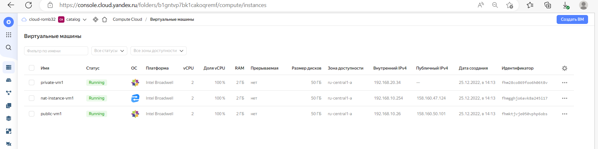
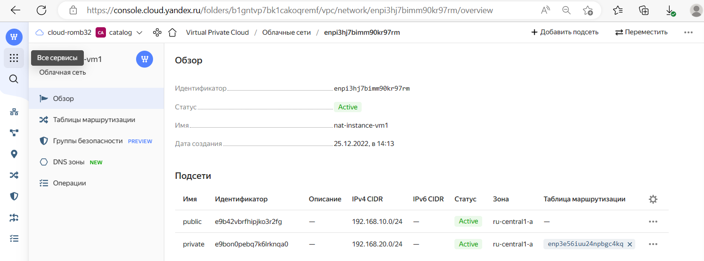
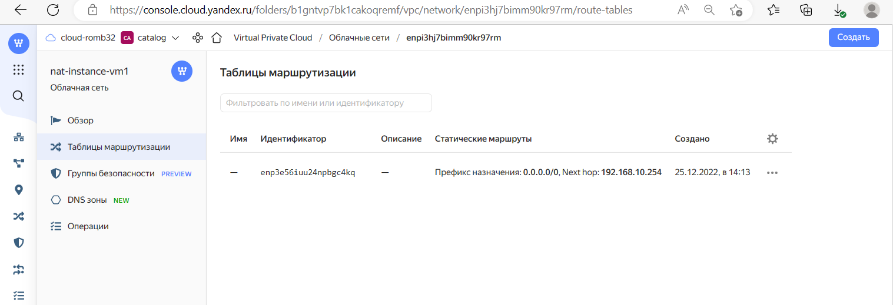

# Домашнее задание к занятию "15.1. Организация сети"

Домашнее задание будет состоять из обязательной части, которую необходимо выполнить на провайдере Яндекс.Облако и дополнительной части в AWS по желанию. Все домашние задания в 15 блоке связаны друг с другом и в конце представляют пример законченной инфраструктуры.  
Все задания требуется выполнить с помощью Terraform, результатом выполненного домашнего задания будет код в репозитории. 

Перед началом работ следует настроить доступ до облачных ресурсов из Terraform используя материалы прошлых лекций и [ДЗ](https://github.com/netology-code/virt-homeworks/tree/master/07-terraform-02-syntax ). А также заранее выбрать регион (в случае AWS) и зону.

---
## Задание 1. Яндекс.Облако (обязательное к выполнению)

1. Создать VPC.
- Создать пустую VPC. Выбрать зону.
2. Публичная подсеть.
- Создать в vpc subnet с названием public, сетью 192.168.10.0/24.
- Создать в этой подсети NAT-инстанс, присвоив ему адрес 192.168.10.254. В качестве image_id использовать fd80mrhj8fl2oe87o4e1
- Создать в этой публичной подсети виртуалку с публичным IP и подключиться к ней, убедиться что есть доступ к интернету.
3. Приватная подсеть.
- Создать в vpc subnet с названием private, сетью 192.168.20.0/24.
- Создать route table. Добавить статический маршрут, направляющий весь исходящий трафик private сети в NAT-инстанс
- Создать в этой приватной подсети виртуалку с внутренним IP, подключиться к ней через виртуалку, созданную ранее и убедиться что есть доступ к интернету

Resource terraform для ЯО
- [VPC subnet](https://registry.terraform.io/providers/yandex-cloud/yandex/latest/docs/resources/vpc_subnet)
- [Route table](https://registry.terraform.io/providers/yandex-cloud/yandex/latest/docs/resources/vpc_route_table)
- [Compute Instance](https://registry.terraform.io/providers/yandex-cloud/yandex/latest/docs/resources/compute_instance)
---
## Задание 2*. AWS (необязательное к выполнению)

1. Создать VPC.
- Cоздать пустую VPC с подсетью 10.10.0.0/16.
2. Публичная подсеть.
- Создать в vpc subnet с названием public, сетью 10.10.1.0/24
- Разрешить в данной subnet присвоение public IP по-умолчанию. 
- Создать Internet gateway 
- Добавить в таблицу маршрутизации маршрут, направляющий весь исходящий трафик в Internet gateway.
- Создать security group с разрешающими правилами на SSH и ICMP. Привязать данную security-group на все создаваемые в данном ДЗ виртуалки
- Создать в этой подсети виртуалку и убедиться, что инстанс имеет публичный IP. Подключиться к ней, убедиться что есть доступ к интернету.
- Добавить NAT gateway в public subnet.
3. Приватная подсеть.
- Создать в vpc subnet с названием private, сетью 10.10.2.0/24
- Создать отдельную таблицу маршрутизации и привязать ее к private-подсети
- Добавить Route, направляющий весь исходящий трафик private сети в NAT.
- Создать виртуалку в приватной сети.
- Подключиться к ней по SSH по приватному IP через виртуалку, созданную ранее в публичной подсети и убедиться, что с виртуалки есть выход в интернет.

Resource terraform
- [VPC](https://registry.terraform.io/providers/hashicorp/aws/latest/docs/resources/vpc)
- [Subnet](https://registry.terraform.io/providers/hashicorp/aws/latest/docs/resources/subnet)
- [Internet Gateway](https://registry.terraform.io/providers/hashicorp/aws/latest/docs/resources/internet_gateway)

---

# Ответ

## Задание 1


- Написал [конфигурацию](terraform) terraform  


<details><summary>terraform init</summary>

```
p@p:~/yandex-cloud$ terraform init

Initializing the backend...

Initializing provider plugins...
- Finding latest version of yandex-cloud/yandex...
- Installing yandex-cloud/yandex v0.84.0...
- Installed yandex-cloud/yandex v0.84.0 (self-signed, key ID E40F590B50BB8E40)

Partner and community providers are signed by their developers.
If you'd like to know more about provider signing, you can read about it here:
https://www.terraform.io/docs/cli/plugins/signing.html

Terraform has created a lock file .terraform.lock.hcl to record the provider
selections it made above. Include this file in your version control repository
so that Terraform can guarantee to make the same selections by default when
you run "terraform init" in the future.

Terraform has been successfully initialized!

You may now begin working with Terraform. Try running "terraform plan" to see
any changes that are required for your infrastructure. All Terraform commands
should now work.

If you ever set or change modules or backend configuration for Terraform,
rerun this command to reinitialize your working directory. If you forget, other
commands will detect it and remind you to do so if necessary.


```
</details>


<details><summary>terraform validate</summary>

```
p@p:~/yandex-cloud$ terraform validate
Success! The configuration is valid.

```

</details>


 

<details><summary>terraform plan</summary>

```
Apply complete! Resources: 7 added, 0 changed, 0 destroyed.

Outputs:

external_ip_address_nat_vm = "158.160.47.124"
external_ip_address_private_vm = ""
external_ip_address_public_vm = "158.160.50.101"
internal_ip_address_nat_vm = "192.168.10.254"
internal_ip_address_private_vm = "192.168.20.34"
internal_ip_address_public_vm = "192.168.10.26"
```

</details>


<details><summary>terraform apply -auto-approve</summary>

```

p@p:~/yandex-cloud$ terraform apply -auto-approve

Terraform used the selected providers to generate the following execution plan. Resource actions are indicated with the
following symbols:
  + create

Terraform will perform the following actions:

  # yandex_compute_instance.nat-instance will be created
  + resource "yandex_compute_instance" "nat-instance" {
      + created_at                = (known after apply)
      + folder_id                 = (known after apply)
      + fqdn                      = (known after apply)
      + hostname                  = "nat-instance-vm1.netology.cloud"
      + id                        = (known after apply)
      + metadata                  = {
          + "ssh-keys" = <<-EOT
                ubuntu:ssh-rsa AAAAB3NzaC1yc2EAAAADAQABAAABgQCb5J1yyxETplmesXqCX2w2LO+ZHI6gJnRzcRwVR/1Eq36eUhpdDbcZKp7XUCZbymVh4bWyQGuw5qeVje6XbzxoBlWhV3Tw8hvvhS68JG7WMPA30s2ViHzbNqnqbkNQk43TWn9Xl2ZiQLnyi+mxCCeYaNNbVgkUGAQMLmiPdUFl8GdSR8lFKdVo8TQ23kZ0Mszcno7x2+P3hWm3vPz5v68XSTg1B+kAvNRLRt9s5OwM8jI9LUX8ulC3fSkDqoVMIi8MWzrUz2Zu/AzsTsYUuhLEsQV/Njkmdrn3iC1HlaMFQGJOGnUrxb8lm2qWXpQJB9tAaAy/bL/RZMXTpIB1l37dKvVJDaODpyAjEyT9LWq6PL7D7HLDsmX6n58zd9xjOZl5hGtk9rryTQW+biEXjwwedYMEVYdys8fSuAHTIUTSuaIO+131EeZp7BTBcrnpslHzUxvMWsmL2uA3lVLyoGRffXKVbnsmu52KmJnvl28aKULnco3Lp9FeI+urc+MS7Mc= p@p
            EOT
        }
      + name                      = "nat-instance-vm1"
      + network_acceleration_type = "standard"
      + platform_id               = "standard-v1"
      + service_account_id        = (known after apply)
      + status                    = (known after apply)
      + zone                      = "ru-central1-a"

      + boot_disk {
          + auto_delete = true
          + device_name = (known after apply)
          + disk_id     = (known after apply)
          + mode        = (known after apply)

          + initialize_params {
              + block_size  = (known after apply)
              + description = (known after apply)
              + image_id    = "fd80mrhj8fl2oe87o4e1"
              + name        = "root-nat-instance-vm1"
              + size        = 50
              + snapshot_id = (known after apply)
              + type        = "network-nvme"
            }
        }

      + metadata_options {
          + aws_v1_http_endpoint = (known after apply)
          + aws_v1_http_token    = (known after apply)
          + gce_http_endpoint    = (known after apply)
          + gce_http_token       = (known after apply)
        }

      + network_interface {
          + index              = (known after apply)
          + ip_address         = "192.168.10.254"
          + ipv4               = true
          + ipv6               = (known after apply)
          + ipv6_address       = (known after apply)
          + mac_address        = (known after apply)
          + nat                = true
          + nat_ip_address     = (known after apply)
          + nat_ip_version     = (known after apply)
          + security_group_ids = (known after apply)
          + subnet_id          = (known after apply)
        }

      + placement_policy {
          + host_affinity_rules = (known after apply)
          + placement_group_id  = (known after apply)
        }

      + resources {
          + core_fraction = 100
          + cores         = 2
          + memory        = 2
        }

      + scheduling_policy {
          + preemptible = (known after apply)
        }
    }

  # yandex_compute_instance.private-vm will be created
  + resource "yandex_compute_instance" "private-vm" {
      + created_at                = (known after apply)
      + folder_id                 = (known after apply)
      + fqdn                      = (known after apply)
      + hostname                  = "private-vm1.netology.cloud"
      + id                        = (known after apply)
      + metadata                  = {
          + "ssh-keys" = <<-EOT
                ubuntu:ssh-rsa AAAAB3NzaC1yc2EAAAADAQABAAABgQCb5J1yyxETplmesXqCX2w2LO+ZHI6gJnRzcRwVR/1Eq36eUhpdDbcZKp7XUCZbymVh4bWyQGuw5qeVje6XbzxoBlWhV3Tw8hvvhS68JG7WMPA30s2ViHzbNqnqbkNQk43TWn9Xl2ZiQLnyi+mxCCeYaNNbVgkUGAQMLmiPdUFl8GdSR8lFKdVo8TQ23kZ0Mszcno7x2+P3hWm3vPz5v68XSTg1B+kAvNRLRt9s5OwM8jI9LUX8ulC3fSkDqoVMIi8MWzrUz2Zu/AzsTsYUuhLEsQV/Njkmdrn3iC1HlaMFQGJOGnUrxb8lm2qWXpQJB9tAaAy/bL/RZMXTpIB1l37dKvVJDaODpyAjEyT9LWq6PL7D7HLDsmX6n58zd9xjOZl5hGtk9rryTQW+biEXjwwedYMEVYdys8fSuAHTIUTSuaIO+131EeZp7BTBcrnpslHzUxvMWsmL2uA3lVLyoGRffXKVbnsmu52KmJnvl28aKULnco3Lp9FeI+urc+MS7Mc= p@p
            EOT
        }
      + name                      = "private-vm1"
      + network_acceleration_type = "standard"
      + platform_id               = "standard-v1"
      + service_account_id        = (known after apply)
      + status                    = (known after apply)
      + zone                      = "ru-central1-a"

      + boot_disk {
          + auto_delete = true
          + device_name = (known after apply)
          + disk_id     = (known after apply)
          + mode        = (known after apply)

          + initialize_params {
              + block_size  = (known after apply)
              + description = (known after apply)
              + image_id    = "fd8jvcoeij6u9se84dt5"
              + name        = "root-private-vm1"
              + size        = 50
              + snapshot_id = (known after apply)
              + type        = "network-nvme"
            }
        }

      + metadata_options {
          + aws_v1_http_endpoint = (known after apply)
          + aws_v1_http_token    = (known after apply)
          + gce_http_endpoint    = (known after apply)
          + gce_http_token       = (known after apply)
        }

      + network_interface {
          + index              = (known after apply)
          + ip_address         = (known after apply)
          + ipv4               = true
          + ipv6               = (known after apply)
          + ipv6_address       = (known after apply)
          + mac_address        = (known after apply)
          + nat                = false
          + nat_ip_address     = (known after apply)
          + nat_ip_version     = (known after apply)
          + security_group_ids = (known after apply)
          + subnet_id          = (known after apply)
        }

      + placement_policy {
          + host_affinity_rules = (known after apply)
          + placement_group_id  = (known after apply)
        }

      + resources {
          + core_fraction = 100
          + cores         = 2
          + memory        = 2
        }

      + scheduling_policy {
          + preemptible = (known after apply)
        }
    }

  # yandex_compute_instance.public-vm will be created
  + resource "yandex_compute_instance" "public-vm" {
      + created_at                = (known after apply)
      + folder_id                 = (known after apply)
      + fqdn                      = (known after apply)
      + hostname                  = "public-vm1.netology.cloud"
      + id                        = (known after apply)
      + metadata                  = {
          + "ssh-keys" = <<-EOT
                ubuntu:ssh-rsa AAAAB3NzaC1yc2EAAAADAQABAAABgQCb5J1yyxETplmesXqCX2w2LO+ZHI6gJnRzcRwVR/1Eq36eUhpdDbcZKp7XUCZbymVh4bWyQGuw5qeVje6XbzxoBlWhV3Tw8hvvhS68JG7WMPA30s2ViHzbNqnqbkNQk43TWn9Xl2ZiQLnyi+mxCCeYaNNbVgkUGAQMLmiPdUFl8GdSR8lFKdVo8TQ23kZ0Mszcno7x2+P3hWm3vPz5v68XSTg1B+kAvNRLRt9s5OwM8jI9LUX8ulC3fSkDqoVMIi8MWzrUz2Zu/AzsTsYUuhLEsQV/Njkmdrn3iC1HlaMFQGJOGnUrxb8lm2qWXpQJB9tAaAy/bL/RZMXTpIB1l37dKvVJDaODpyAjEyT9LWq6PL7D7HLDsmX6n58zd9xjOZl5hGtk9rryTQW+biEXjwwedYMEVYdys8fSuAHTIUTSuaIO+131EeZp7BTBcrnpslHzUxvMWsmL2uA3lVLyoGRffXKVbnsmu52KmJnvl28aKULnco3Lp9FeI+urc+MS7Mc= p@p
            EOT
        }
      + name                      = "public-vm1"
      + network_acceleration_type = "standard"
      + platform_id               = "standard-v1"
      + service_account_id        = (known after apply)
      + status                    = (known after apply)
      + zone                      = "ru-central1-a"

      + boot_disk {
          + auto_delete = true
          + device_name = (known after apply)
          + disk_id     = (known after apply)
          + mode        = (known after apply)

          + initialize_params {
              + block_size  = (known after apply)
              + description = (known after apply)
              + image_id    = "fd8jvcoeij6u9se84dt5"
              + name        = "root-public-vm1"
              + size        = 50
              + snapshot_id = (known after apply)
              + type        = "network-nvme"
            }
        }

      + metadata_options {
          + aws_v1_http_endpoint = (known after apply)
          + aws_v1_http_token    = (known after apply)
          + gce_http_endpoint    = (known after apply)
          + gce_http_token       = (known after apply)
        }

      + network_interface {
          + index              = (known after apply)
          + ip_address         = (known after apply)
          + ipv4               = true
          + ipv6               = (known after apply)
          + ipv6_address       = (known after apply)
          + mac_address        = (known after apply)
          + nat                = true
          + nat_ip_address     = (known after apply)
          + nat_ip_version     = (known after apply)
          + security_group_ids = (known after apply)
          + subnet_id          = (known after apply)
        }

      + placement_policy {
          + host_affinity_rules = (known after apply)
          + placement_group_id  = (known after apply)
        }

      + resources {
          + core_fraction = 100
          + cores         = 2
          + memory        = 2
        }

      + scheduling_policy {
          + preemptible = (known after apply)
        }
    }

  # yandex_vpc_network.nat-instance-vm1 will be created
  + resource "yandex_vpc_network" "nat-instance-vm1" {
      + created_at                = (known after apply)
      + default_security_group_id = (known after apply)
      + folder_id                 = (known after apply)
      + id                        = (known after apply)
      + labels                    = (known after apply)
      + name                      = "nat-instance-vm1"
      + subnet_ids                = (known after apply)
    }

  # yandex_vpc_route_table.nat-route-table will be created
  + resource "yandex_vpc_route_table" "nat-route-table" {
      + created_at = (known after apply)
      + folder_id  = (known after apply)
      + id         = (known after apply)
      + labels     = (known after apply)
      + network_id = (known after apply)

      + static_route {
          + destination_prefix = "0.0.0.0/0"
          + next_hop_address   = "192.168.10.254"
        }
    }

  # yandex_vpc_subnet.subnet-private will be created
  + resource "yandex_vpc_subnet" "subnet-private" {
      + created_at     = (known after apply)
      + folder_id      = (known after apply)
      + id             = (known after apply)
      + labels         = (known after apply)
      + name           = "private"
      + network_id     = (known after apply)
      + route_table_id = (known after apply)
      + v4_cidr_blocks = [
          + "192.168.20.0/24",
        ]
      + v6_cidr_blocks = (known after apply)
      + zone           = "ru-central1-a"
    }

  # yandex_vpc_subnet.subnet-public will be created
  + resource "yandex_vpc_subnet" "subnet-public" {
      + created_at     = (known after apply)
      + folder_id      = (known after apply)
      + id             = (known after apply)
      + labels         = (known after apply)
      + name           = "public"
      + network_id     = (known after apply)
      + v4_cidr_blocks = [
          + "192.168.10.0/24",
        ]
      + v6_cidr_blocks = (known after apply)
      + zone           = "ru-central1-a"
    }

Plan: 7 to add, 0 to change, 0 to destroy.

Changes to Outputs:
  + external_ip_address_nat_vm     = (known after apply)
  + external_ip_address_private_vm = (known after apply)
  + external_ip_address_public_vm  = (known after apply)
  + internal_ip_address_private_vm = (known after apply)
  + internal_ip_address_public_vm  = (known after apply)
yandex_vpc_network.nat-instance-vm1: Creating...
yandex_vpc_network.nat-instance-vm1: Creation complete after 1s [id=enpi3hj7bimm90kr97rm]
yandex_vpc_subnet.subnet-public: Creating...
yandex_vpc_route_table.nat-route-table: Creating...
yandex_vpc_subnet.subnet-public: Creation complete after 0s [id=e9b42vbrfhipjko3r2fg]
yandex_compute_instance.public-vm: Creating...
yandex_compute_instance.nat-instance: Creating...
yandex_vpc_route_table.nat-route-table: Creation complete after 1s [id=enp3e56iuu24npbgc4kq]
yandex_vpc_subnet.subnet-private: Creating...
yandex_vpc_subnet.subnet-private: Creation complete after 1s [id=e9bon0pebq7k6lrknqa0]
yandex_compute_instance.private-vm: Creating...
yandex_compute_instance.public-vm: Still creating... [10s elapsed]
yandex_compute_instance.nat-instance: Still creating... [10s elapsed]
yandex_compute_instance.private-vm: Still creating... [10s elapsed]
yandex_compute_instance.nat-instance: Still creating... [20s elapsed]
yandex_compute_instance.public-vm: Still creating... [20s elapsed]
yandex_compute_instance.private-vm: Still creating... [20s elapsed]
yandex_compute_instance.public-vm: Still creating... [30s elapsed]
yandex_compute_instance.nat-instance: Still creating... [30s elapsed]
yandex_compute_instance.private-vm: Still creating... [30s elapsed]
yandex_compute_instance.private-vm: Creation complete after 30s [id=fhm28co869foo6h06t8v]
yandex_compute_instance.public-vm: Creation complete after 34s [id=fhmktjvje050vphp6obs]
yandex_compute_instance.nat-instance: Still creating... [40s elapsed]
yandex_compute_instance.nat-instance: Still creating... [50s elapsed]
yandex_compute_instance.nat-instance: Creation complete after 57s [id=fhmgghjo6avk8a245i17]

Apply complete! Resources: 7 added, 0 changed, 0 destroyed.

Outputs:

external_ip_address_nat_vm = "158.160.47.124"
external_ip_address_private_vm = ""
external_ip_address_public_vm = "158.160.50.101"
internal_ip_address_nat_vm = "192.168.10.254"
internal_ip_address_private_vm = "192.168.20.34"
internal_ip_address_public_vm = "192.168.10.26"


```

</details>

  
<details><summary>Подключился к виртуалке в публичной сети с публичным IP. Проверил что есть интернет. </summary>

```
centos@public-vm1:~$ curl ifconfig.me
158.160.50.101centos@private-vm1:~$ ping ya.ru
PING ya.ru (87.250.250.242) 56(84) bytes of data.
64 bytes from ya.ru (87.250.250.242): icmp_seq=1 ttl=244 time=14.7 ms
64 bytes from ya.ru (87.250.250.242): icmp_seq=2 ttl=244 time=12.6 ms
64 bytes from ya.ru (87.250.250.242): icmp_seq=3 ttl=244 time=12.0 ms

```

</details>

  

<details><summary>Подключился к виртуалке во внутренней сети и проверил, что есть доступ в интернет</summary>

```
centos@public-vm1:~$ ssh 192.168.20.34
centos@public-vm1:~$ curl ifconfig.me
158.160.47.124centos@public-vm1:~$ ping ya.ru
PING ya.ru (87.250.250.242) 56(84) bytes of data.
64 bytes from ya.ru (87.250.250.242): icmp_seq=1 ttl=244 time=14.7 ms
64 bytes from ya.ru (87.250.250.242): icmp_seq=2 ttl=244 time=12.6 ms
64 bytes from ya.ru (87.250.250.242): icmp_seq=3 ttl=244 time=12.0 ms
```

</details>


- Виртуальные машины в yandex.cloud

 

- IP-адреса подсети

 

- Таблицы маршрутизации

 


  
