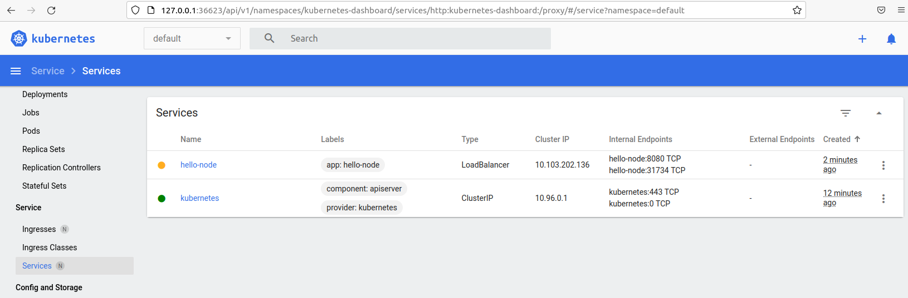
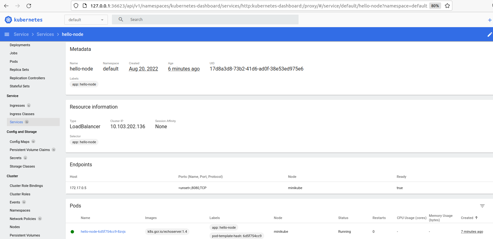

# Домашнее задание к занятию "12.1 Компоненты Kubernetes"

Вы DevOps инженер в крупной компании с большим парком сервисов. Ваша задача — разворачивать эти продукты в корпоративном кластере. 

## Задача 1: Установить Minikube

Для экспериментов и валидации ваших решений вам нужно подготовить тестовую среду для работы с Kubernetes. Оптимальное решение — развернуть на рабочей машине Minikube.

### Как поставить на AWS:
- создать EC2 виртуальную машину (Ubuntu Server 20.04 LTS (HVM), SSD Volume Type) с типом **t3.small**. Для работы потребуется настроить Security Group для доступа по ssh. Не забудьте указать keypair, он потребуется для подключения.
- подключитесь к серверу по ssh (ssh ubuntu@<ipv4_public_ip> -i <keypair>.pem)
- установите миникуб и докер следующими командами:
  - curl -LO https://storage.googleapis.com/kubernetes-release/release/`curl -s https://storage.googleapis.com/kubernetes-release/release/stable.txt`/bin/linux/amd64/kubectl
  - chmod +x ./kubectl
  - sudo mv ./kubectl /usr/local/bin/kubectl
  - sudo apt-get update && sudo apt-get install docker.io conntrack -y
  - curl -Lo minikube https://storage.googleapis.com/minikube/releases/latest/minikube-linux-amd64 && chmod +x minikube && sudo mv minikube /usr/local/bin/
- проверить версию можно командой minikube version
- переключаемся на root и запускаем миникуб: minikube start --vm-driver=none
- после запуска стоит проверить статус: minikube status
- запущенные служебные компоненты можно увидеть командой: kubectl get pods --namespace=kube-system

### Для сброса кластера стоит удалить кластер и создать заново:
- minikube delete
- minikube start --vm-driver=none

Возможно, для повторного запуска потребуется выполнить команду: sudo sysctl fs.protected_regular=0

Инструкция по установке Minikube - [ссылка](https://kubernetes.io/ru/docs/tasks/tools/install-minikube/)

**Важно**: t3.small не входит во free tier, следите за бюджетом аккаунта и удаляйте виртуалку.

## Ответ:
## Задача 1: Установить Minikube

p@ubuntu:~$ minikube status
minikube
type: Control Plane
host: Running
kubelet: Running
apiserver: Running
kubeconfig: Configured
p@ubuntu:~$ kubectl get pods --namespace=kube-system
NAME READY STATUS RESTARTS AGE
coredns-6d4b75cb6d-fvsdf 1/1 Running 0 32s
etcd-minikube 1/1 Running 0 44s
kube-apiserver-minikube 1/1 Running 0 44s
kube-controller-manager-minikube 1/1 Running 0 44s
kube-proxy-f9j2d 1/1 Running 0 32s
kube-scheduler-minikube 1/1 Running 0 44s
storage-provisioner 1/1 Running 1 (11s ago) 42s

## Задача 2: Запуск Hello World
После установки Minikube требуется его проверить. Для этого подойдет стандартное приложение hello world. А для доступа к нему потребуется ingress.

- развернуть через Minikube тестовое приложение по [туториалу](https://kubernetes.io/ru/docs/tutorials/hello-minikube/#%D1%81%D0%BE%D0%B7%D0%B4%D0%B0%D0%BD%D0%B8%D0%B5-%D0%BA%D0%BB%D0%B0%D1%81%D1%82%D0%B5%D1%80%D0%B0-minikube)
- установить аддоны ingress и dashboard

## Ответ:
## Задача 2: Запуск Hello World

p@ubuntu:~$ minikube dashboard

Enabling dashboard ...

▪ Using image kubernetesui/dashboard:v2.6.0

▪ Using image kubernetesui/metrics-scraper:v1.0.8

Verifying dashboard health ...

Launching proxy ...

Verifying proxy health ...

Opening http://127.0.0.1:36623/api/v1/namespaces/kubernetes-dashboard/services/http:kubernetes-dashboard:/proxy/ in your default browser...

Missing chrome or resource URL: resource://gre/modules/UpdateListener.jsm

Missing chrome or resource URL: resource://gre/modules/UpdateListener.sys.mjs

p@ubuntu:~$ minikube addons list

|-----------------------------|----------|--------------|--------------------------------|
| ADDON NAME | PROFILE | STATUS | MAINTAINER |
|-----------------------------|----------|--------------|--------------------------------|
| ambassador | minikube | disabled | 3rd party (Ambassador) |
| auto-pause | minikube | disabled | Google |
| csi-hostpath-driver | minikube | disabled | Kubernetes |
| dashboard | minikube | enabled ✅ | Kubernetes |
| default-storageclass | minikube | enabled ✅ | Kubernetes |
| efk | minikube | disabled | 3rd party (Elastic) |
| freshpod | minikube | disabled | Google |
| gcp-auth | minikube | disabled | Google |
| gvisor | minikube | disabled | Google |
| headlamp | minikube | disabled | 3rd party (kinvolk.io) |
| helm-tiller | minikube | disabled | 3rd party (Helm) |
| inaccel | minikube | disabled | 3rd party (InAccel |
| | | | [info@inaccel.com]) |
| ingress | minikube | disabled | Kubernetes |
| ingress-dns | minikube | disabled | Google |
| istio | minikube | disabled | 3rd party (Istio) |
| istio-provisioner | minikube | disabled | 3rd party (Istio) |
| kong | minikube | disabled | 3rd party (Kong HQ) |
| kubevirt | minikube | disabled | 3rd party (KubeVirt) |
| logviewer | minikube | disabled | 3rd party (unknown) |
| metallb | minikube | disabled | 3rd party (MetalLB) |
| metrics-server | minikube | disabled | Kubernetes |
| nvidia-driver-installer | minikube | disabled | Google |
| nvidia-gpu-device-plugin | minikube | disabled | 3rd party (Nvidia) |
| olm | minikube | disabled | 3rd party (Operator Framework) |
| pod-security-policy | minikube | disabled | 3rd party (unknown) |
| portainer | minikube | disabled | 3rd party (Portainer.io) |
| registry | minikube | disabled | Google |
| registry-aliases | minikube | disabled | 3rd party (unknown) |
| registry-creds | minikube | disabled | 3rd party (UPMC Enterprises) |
| storage-provisioner | minikube | enabled ✅ | Google |
| storage-provisioner-gluster | minikube | disabled | 3rd party (Gluster) |
| volumesnapshots | minikube | disabled | Kubernetes |
|-----------------------------|----------|--------------|--------------------------------|

p@ubuntu:~$ minikube service hello-node
❌ Exiting due to SVC_NOT_FOUND: Service 'hello-node' was not found in 'default' namespace.
You may select another namespace by using 'minikube service hello-node -n <namespace>'. Or list out all the services using 'minikube service list'
p@ubuntu:~$ kubectl expose deployment hello-node --type=LoadBalancer --port=8080
Error from server (NotFound): deployments.apps "hello-node" not found
p@ubuntu:~$ kubectl create deployment hello-node --image=k8s.gcr.io/echoserver:1.4
deployment.apps/hello-node created
p@ubuntu:~$ kubectl get deployments
NAME READY UP-TO-DATE AVAILABLE AGE
hello-node 1/1 1 1 11s
p@ubuntu:~$ kubectl get pods
NAME READY STATUS RESTARTS AGE
hello-node-6d5f754cc9-8zvjs 1/1 Running 0 21s
p@ubuntu:~$ kubectl get events
LAST SEEN TYPE REASON OBJECT MESSAGE
31s Normal Scheduled pod/hello-node-6d5f754cc9-8zvjs Successfully assigned default/hello-node-6d5f754cc9-8zvjs to minikube
31s Normal Pulling pod/hello-node-6d5f754cc9-8zvjs Pulling image "k8s.gcr.io/echoserver:1.4"
24s Normal Pulled pod/hello-node-6d5f754cc9-8zvjs Successfully pulled image "k8s.gcr.io/echoserver:1.4" in 6.489141417s
24s Normal Created pod/hello-node-6d5f754cc9-8zvjs Created container echoserver
24s Normal Started pod/hello-node-6d5f754cc9-8zvjs Started container echoserver
31s Normal SuccessfulCreate replicaset/hello-node-6d5f754cc9 Created pod: hello-node-6d5f754cc9-8zvjs
31s Normal ScalingReplicaSet deployment/hello-node Scaled up replica set hello-node-6d5f754cc9 to 1
9m58s Normal Starting node/minikube Starting kubelet.
9m58s Normal NodeHasSufficientMemory node/minikube Node minikube status is now: NodeHasSufficientMemory
9m58s Normal NodeHasNoDiskPressure node/minikube Node minikube status is now: NodeHasNoDiskPressure
9m58s Normal NodeHasSufficientPID node/minikube Node minikube status is now: NodeHasSufficientPID
9m58s Normal NodeAllocatableEnforced node/minikube Updated Node Allocatable limit across pods
9m45s Normal Starting node/minikube Starting kubelet.
9m45s Normal NodeHasSufficientMemory node/minikube Node minikube status is now: NodeHasSufficientMemory
9m45s Normal NodeHasNoDiskPressure node/minikube Node minikube status is now: NodeHasNoDiskPressure
9m45s Normal NodeHasSufficientPID node/minikube Node minikube status is now: NodeHasSufficientPID
9m44s Normal NodeAllocatableEnforced node/minikube Updated Node Allocatable limit across pods
9m34s Normal NodeReady node/minikube Node minikube status is now: NodeReady
9m33s Normal RegisteredNode node/minikube Node minikube event: Registered Node minikube in Controller
9m30s Normal Starting node/minikube
p@ubuntu:~$ kubectl config view
apiVersion: v1
clusters:
- cluster:
certificate-authority: /home/p/.minikube/ca.crt
extensions:
- extension:
last-update: Sat, 20 Aug 2022 06:23:52 PDT
provider: minikube.sigs.k8s.io
version: v1.26.1
name: cluster_info
server: https://192.168.49.2:8443
name: minikube
contexts:
- context:
cluster: minikube
extensions:
- extension:
last-update: Sat, 20 Aug 2022 06:23:52 PDT
provider: minikube.sigs.k8s.io
version: v1.26.1
name: context_info
namespace: default
user: minikube
name: minikube
current-context: minikube
kind: Config
preferences: {}
users:
- name: minikube
user:
client-certificate: /home/p/.minikube/profiles/minikube/client.crt
client-key: /home/p/.minikube/profiles/minikube/client.key
p@ubuntu:~$ kubectl expose deployment hello-node --type=LoadBalancer --port=8080
service/hello-node exposed
p@ubuntu:~$ kubectl get services
NAME TYPE CLUSTER-IP EXTERNAL-IP PORT(S) AGE
hello-node LoadBalancer 10.103.202.136 <pending> 8080:31734/TCP 7s
kubernetes ClusterIP 10.96.0.1 <none> 443/TCP 10m
p@ubuntu:~$ minikube service hello-node
|-----------|------------|-------------|---------------------------|
| NAMESPACE | NAME | TARGET PORT | URL |
|-----------|------------|-------------|---------------------------|
| default | hello-node | 8080 | http://192.168.49.2:31734 |
|-----------|------------|-------------|---------------------------|
Opening service default/hello-node in default browser...

## Задача 3: Установить kubectl
Подготовить рабочую машину для управления корпоративным кластером. Установить клиентское приложение kubectl.
- подключиться к minikube 
- проверить работу приложения из задания 2, запустив port-forward до кластера

## Ответ.
p@ubuntu:~$ kubectl get services
NAME TYPE CLUSTER-IP EXTERNAL-IP PORT(S) AGE
hello-node LoadBalancer 10.103.202.136 <pending> 8080:31734/TCP 7s
kubernetes ClusterIP 10.96.0.1 <none> 443/TCP 10m
p@ubuntu:~$ minikube service hello-node
|-----------|------------|-------------|---------------------------|
| NAMESPACE | NAME | TARGET PORT | URL |
|-----------|------------|-------------|---------------------------|
| default | hello-node | 8080 | http://192.168.49.2:31734 |
|-----------|------------|-------------|---------------------------|
Opening service default/hello-node in default browser...

p@ubuntu:~$ minikube addons enable metrics-server
metrics-server is an addon maintained by Kubernetes. For any concerns contact minikube on GitHub.
You can view the list of minikube maintainers at: https://github.com/kubernetes/minikube/blob/master/OWNERS
▪ Using image k8s.gcr.io/metrics-server/metrics-server:v0.6.1
The 'metrics-server' addon is enabled
p@ubuntu:~$ kubectl get pod,svc -n kube-system
NAME READY STATUS RESTARTS AGE
pod/coredns-6d4b75cb6d-fvsdf 1/1 Running 0 11m
pod/etcd-minikube 1/1 Running 0 11m
pod/kube-apiserver-minikube 1/1 Running 0 11m
pod/kube-controller-manager-minikube 1/1 Running 0 11m
pod/kube-proxy-f9j2d 1/1 Running 0 11m
pod/kube-scheduler-minikube 1/1 Running 0 11m
pod/metrics-server-8595bd7d4c-7zh5l 0/1 Running 0 11s
pod/storage-provisioner 1/1 Running 1 (11m ago) 11m
NAME TYPE CLUSTER-IP EXTERNAL-IP PORT(S) AGE
service/kube-dns ClusterIP 10.96.0.10 <none> 53/UDP,53/TCP,9153/TCP 11m
service/metrics-server ClusterIP 10.111.90.25 <none> 443/TCP 11s
p@ubuntu:~$ minikube addons disable metrics-server
"The 'metrics-server' addon is disabled
p@ubuntu:~$ minikube service hello-node
|-----------|------------|-------------|---------------------------|
| NAMESPACE | NAME | TARGET PORT | URL |
|-----------|------------|-------------|---------------------------|
| default | hello-node | 8080 | http://192.168.49.2:31734 |
|-----------|------------|-------------|---------------------------|
Opening service default/hello-node in default browser...

p@ubuntu:~$ netstat -plunt
(Not all processes could be identified, non-owned process info
will not be shown, you would have to be root to see it all.)
Active Internet connections (only servers)
Proto Recv-Q Send-Q Local Address Foreign Address State PID/Program name
tcp 0 0 0.0.0.0:22 0.0.0.0:* LISTEN -
tcp 0 0 127.0.0.1:36623 0.0.0.0:* LISTEN 8154/kubectl
tcp 0 0 127.0.0.1:49154 0.0.0.0:* LISTEN -
tcp 0 0 127.0.0.1:49155 0.0.0.0:* LISTEN -
tcp 0 0 127.0.0.1:49153 0.0.0.0:* LISTEN -
tcp 0 0 127.0.0.1:49156 0.0.0.0:* LISTEN -
tcp 0 0 127.0.0.1:49157 0.0.0.0:* LISTEN -
tcp 0 0 127.0.0.1:631 0.0.0.0:* LISTEN -
tcp 0 0 127.0.0.53:53 0.0.0.0:* LISTEN -
tcp6 0 0 :::22 :::* LISTEN -
tcp6 0 0 ::1:631 :::* LISTEN -
udp 0 0 127.0.0.53:53 0.0.0.0:* -
udp 0 0 0.0.0.0:53717 0.0.0.0:* -
udp 0 0 0.0.0.0:631 0.0.0.0:* -
udp 0 0 0.0.0.0:5353 0.0.0.0:* -
udp6 0 0 :::44726 :::* -
udp6 0 0 :::5353 :::* -

p@ubuntu:~$ kubectl get services
NAME TYPE CLUSTER-IP EXTERNAL-IP PORT(S) AGE
hello-node LoadBalancer 10.103.202.136 <pending> 8080:31734/TCP 7m52s
kubernetes ClusterIP 10.96.0.1 <none> 443/TCP 18m

## Задача 4 (*): собрать через ansible (необязательное)
Профессионалы не делают одну и ту же задачу два раза. Давайте закрепим полученные навыки, автоматизировав выполнение заданий  ansible-скриптами. При выполнении задания обратите внимание на доступные модули для k8s под ansible.
 - собрать роль для установки minikube на aws сервисе (с установкой ingress)
 - собрать роль для запуска в кластере hello world
  
  ---

### Как оформить ДЗ?

Выполненное домашнее задание пришлите ссылкой на .md-файл в вашем репозитории.

---
