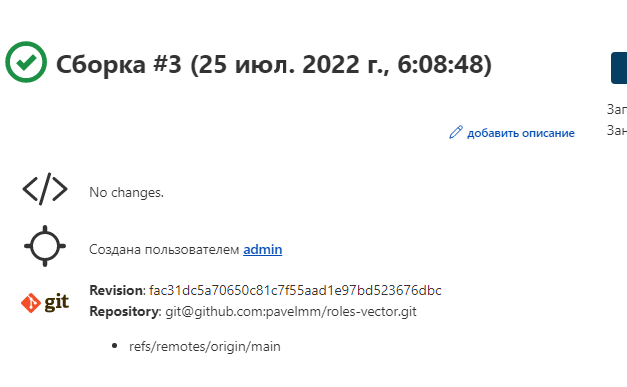
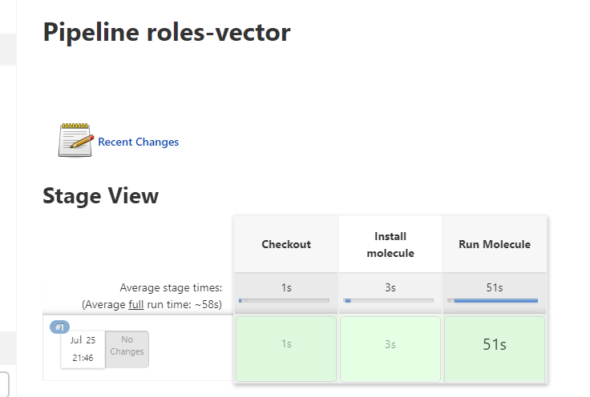
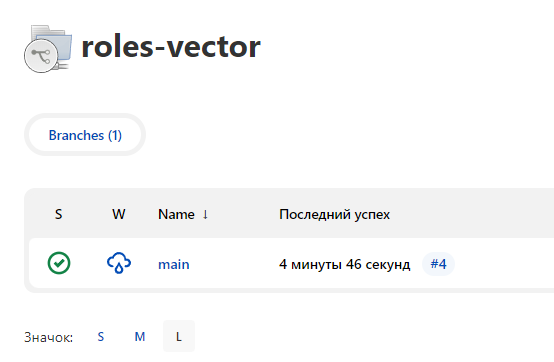
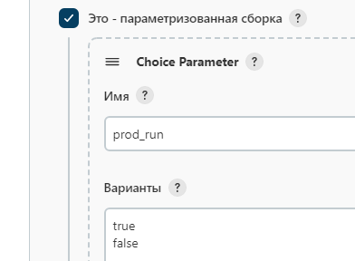

# Домашнее задание к занятию "09.04 Jenkins"

---
## Подготовка к выполнению
1. Создать 2 VM: для jenkins-master и jenkins-agent.
2. Установить jenkins при помощи playbook'a.
3. Запустить и проверить работоспособность.
4. Сделать первоначальную настройку.

## Основная часть

1. Сделать Freestyle Job, который будет запускать `molecule test` из любого вашего репозитория с ролью.



<details><summary>Logs</summary>

```
07:16:01 Started by user admin
07:16:01 Running as SYSTEM
07:16:01 Building remotely on node1 (linux) in workspace /opt/jenkins_agent/workspace/roles-vector
07:16:01 [WS-CLEANUP] Deleting project workspace...
07:16:01 [WS-CLEANUP] Deferred wipeout is disabled by the node property...
07:16:01 The recommended git tool is: NONE
07:16:01 using credential 10410357-13d3-4cf2-a45d-c65629928354
07:16:01 Cloning the remote Git repository
07:16:01 Cloning repository git@github.com:pavelmm/roles-vector.git
07:16:01  > git init /opt/jenkins_agent/workspace/roles-vector # timeout=10
07:16:01 Fetching upstream changes from git@github.com:pavelmm/roles-vector.git
07:16:01  > git --version # timeout=10
07:16:01  > git --version # 'git version 1.8.3.1'
07:16:01 using GIT_SSH to set credentials 
07:16:01 [INFO] Currently running in a labeled security context
07:16:01 [INFO] Currently SELinux is 'enforcing' on the host
07:16:01  > /usr/bin/chcon --type=ssh_home_t /opt/jenkins_agent/workspace/roles-vector@tmp/jenkins-gitclient-ssh17540435216824274410.key
07:16:01  > git fetch --tags --progress git@github.com:pavelmm/roles-vector.git +refs/heads/*:refs/remotes/origin/* # timeout=10
07:16:02  > git config remote.origin.url git@github.com:pavelmm/roles-vector.git # timeout=10
07:16:02  > git config --add remote.origin.fetch +refs/heads/*:refs/remotes/origin/* # timeout=10
07:16:02 Avoid second fetch
07:16:02  > git rev-parse refs/remotes/origin/main^{commit} # timeout=10
07:16:02 Checking out Revision fac31dc5a70650c81c7f55aad1e97bd523676dbc (refs/remotes/origin/main)
07:16:02  > git config core.sparsecheckout # timeout=10
07:16:02  > git checkout -f fac31dc5a70650c81c7f55aad1e97bd523676dbc # timeout=10
07:16:02 Commit message: "v1.2.1"
07:16:02  > git rev-list --no-walk fac31dc5a70650c81c7f55aad1e97bd523676dbc # timeout=10
07:16:02 [roles-vector] $ /bin/sh -xe /tmp/jenkins9923216029577647147.sh
07:16:02 + molecule --version
07:16:03 molecule 3.4.0 using python 3.6 
07:16:03     ansible:2.10.17
07:16:03     delegated:3.4.0 from molecule
07:16:03     docker:1.1.0 from molecule_docker requiring collections: community.docker>=1.9.1
07:16:03 + molecule test -s centos7
07:16:04 INFO     centos7 scenario test matrix: dependency, lint, cleanup, destroy, syntax, create, prepare, converge, idempotence, side_effect, verify, cleanup, destroy
07:16:04 INFO     Performing prerun...
07:16:04 INFO     Guessed /opt/jenkins_agent/workspace/roles-vector as project root directory
07:16:04 WARNING  Computed fully qualified role name of pavelmm.roles-vector does not follow current galaxy requirements.
07:16:04 Please edit meta/main.yml and assure we can correctly determine full role name:
07:16:04 
07:16:04 galaxy_info:
07:16:04 role_name: my_name  # if absent directory name hosting role is used instead
07:16:04 namespace: my_galaxy_namespace  # if absent, author is used instead
07:16:04 
07:16:04 Namespace: https://galaxy.ansible.com/docs/contributing/namespaces.html#galaxy-namespace-limitations
07:16:04 Role: https://galaxy.ansible.com/docs/contributing/creating_role.html#role-names
07:16:04 
07:16:04 As an alternative, you can add 'role-name' to either skip_list or warn_list.
07:16:04 
07:16:04 INFO     Using /home/jenkins/.cache/ansible-lint/04b2fc/roles/pavelmm.roles-vector symlink to current repository in order to enable Ansible to find the role using its expected full name.
07:16:04 INFO     Added ANSIBLE_ROLES_PATH=~/.ansible/roles:/usr/share/ansible/roles:/etc/ansible/roles:/home/jenkins/.cache/ansible-lint/04b2fc/roles
07:16:04 INFO     Running centos7 > dependency
07:16:05 /usr/local/lib/python3.6/site-packages/ansible/parsing/vault/__init__.py:44: CryptographyDeprecationWarning: Python 3.6 is no longer supported by the Python core team. Therefore, support for it is deprecated in cryptography and will be removed in a future release.
07:16:05   from cryptography.exceptions import InvalidSignature
07:16:05 WARNING  Skipping, missing the requirements file.
07:16:05 /usr/local/lib/python3.6/site-packages/ansible/parsing/vault/__init__.py:44: CryptographyDeprecationWarning: Python 3.6 is no longer supported by the Python core team. Therefore, support for it is deprecated in cryptography and will be removed in a future release.
07:16:05   from cryptography.exceptions import InvalidSignature
07:16:05 WARNING  Skipping, missing the requirements file.
07:16:05 INFO     Running centos7 > lint
07:16:05 INFO     Lint is disabled.
07:16:05 INFO     Running centos7 > cleanup
07:16:05 WARNING  Skipping, cleanup playbook not configured.
07:16:05 INFO     Running centos7 > destroy
07:16:05 INFO     Sanity checks: 'docker'
07:16:05 /home/jenkins/.local/lib/python3.6/site-packages/paramiko/transport.py:33: CryptographyDeprecationWarning: Python 3.6 is no longer supported by the Python core team. Therefore, support for it is deprecated in cryptography and will be removed in a future release.
07:16:05   from cryptography.hazmat.backends import default_backend
07:16:06 
07:16:06 PLAY [Destroy] *****************************************************************
07:16:06 
07:16:06 TASK [Destroy molecule instance(s)] ********************************************
07:16:06 /usr/local/lib/python3.6/site-packages/ansible/parsing/vault/__init__.py:44: CryptographyDeprecationWarning: Python 3.6 is no longer supported by the Python core team. Therefore, support for it is deprecated in cryptography and will be removed in a future release.
07:16:06   from cryptography.exceptions import InvalidSignature
07:16:06 changed: [localhost] => (item=instance)
07:16:06 
07:16:06 TASK [Wait for instance(s) deletion to complete] *******************************
07:16:07 FAILED - RETRYING: Wait for instance(s) deletion to complete (300 retries left).
07:16:12 ok: [localhost] => (item=instance)
07:16:12 
07:16:12 TASK [Delete docker networks(s)] ***********************************************
07:16:12 
07:16:12 PLAY RECAP *********************************************************************
07:16:12 localhost                  : ok=2    changed=1    unreachable=0    failed=0    skipped=1    rescued=0    ignored=0
07:16:12 
07:16:12 INFO     Running centos7 > syntax
07:16:12 
07:16:12 playbook: /opt/jenkins_agent/workspace/roles-vector/molecule/centos7/converge.yml
07:16:12 /usr/local/lib/python3.6/site-packages/ansible/parsing/vault/__init__.py:44: CryptographyDeprecationWarning: Python 3.6 is no longer supported by the Python core team. Therefore, support for it is deprecated in cryptography and will be removed in a future release.
07:16:12   from cryptography.exceptions import InvalidSignature
07:16:12 INFO     Running centos7 > create
07:16:13 
07:16:13 PLAY [Create] ******************************************************************
07:16:13 
07:16:13 TASK [Log into a Docker registry] **********************************************
07:16:13 /usr/local/lib/python3.6/site-packages/ansible/parsing/vault/__init__.py:44: CryptographyDeprecationWarning: Python 3.6 is no longer supported by the Python core team. Therefore, support for it is deprecated in cryptography and will be removed in a future release.
07:16:13   from cryptography.exceptions import InvalidSignature
07:16:13 skipping: [localhost] => (item=None)
07:16:13 skipping: [localhost]
07:16:13 
07:16:13 TASK [Check presence of custom Dockerfiles] ************************************
07:16:13 ok: [localhost] => (item={'image': 'centos7', 'name': 'instance', 'pre_build_image': True})
07:16:13 
07:16:13 TASK [Create Dockerfiles from image names] *************************************
07:16:13 skipping: [localhost] => (item={'image': 'centos7', 'name': 'instance', 'pre_build_image': True})
07:16:13 
07:16:13 TASK [Discover local Docker images] ********************************************
07:16:14 ok: [localhost] => (item={'changed': False, 'skipped': True, 'skip_reason': 'Conditional result was False', 'item': {'image': 'centos7', 'name': 'instance', 'pre_build_image': True}, 'ansible_loop_var': 'item', 'i': 0, 'ansible_index_var': 'i'})
07:16:14 
07:16:14 TASK [Build an Ansible compatible image (new)] *********************************
07:16:14 skipping: [localhost] => (item=molecule_local/centos7)
07:16:14 
07:16:14 TASK [Create docker network(s)] ************************************************
07:16:14 
07:16:14 TASK [Determine the CMD directives] ********************************************
07:16:14 ok: [localhost] => (item={'image': 'centos7', 'name': 'instance', 'pre_build_image': True})
07:16:14 
07:16:14 TASK [Create molecule instance(s)] *********************************************
07:16:15 changed: [localhost] => (item=instance)
07:16:15 
07:16:15 TASK [Wait for instance(s) creation to complete] *******************************
07:16:15 FAILED - RETRYING: Wait for instance(s) creation to complete (300 retries left).
07:16:20 changed: [localhost] => (item={'started': 1, 'finished': 0, 'ansible_job_id': '25425352215.916', 'results_file': '/home/jenkins/.ansible_async/25425352215.916', 'changed': True, 'failed': False, 'item': {'image': 'centos7', 'name': 'instance', 'pre_build_image': True}, 'ansible_loop_var': 'item'})
07:16:20 
07:16:20 PLAY RECAP *********************************************************************
07:16:20 localhost                  : ok=5    changed=2    unreachable=0    failed=0    skipped=4    rescued=0    ignored=0
07:16:20 
07:16:20 INFO     Running centos7 > prepare
07:16:20 WARNING  Skipping, prepare playbook not configured.
07:16:20 INFO     Running centos7 > converge
07:16:21 
07:16:21 PLAY [Converge] ****************************************************************
07:16:21 
07:16:21 TASK [Gathering Facts] *********************************************************
07:16:21 /usr/local/lib/python3.6/site-packages/ansible/parsing/vault/__init__.py:44: CryptographyDeprecationWarning: Python 3.6 is no longer supported by the Python core team. Therefore, support for it is deprecated in cryptography and will be removed in a future release.
07:16:21   from cryptography.exceptions import InvalidSignature
07:16:22 ok: [instance]
07:16:22 
07:16:22 TASK [Include roles_vector] ****************************************************
07:16:22 
07:16:22 TASK [roles-vector : Install vector] *******************************************
07:16:22 included: /opt/jenkins_agent/workspace/roles-vector/tasks/install_vector_docker.yml for instance
07:16:22 
07:16:22 TASK [roles-vector : VECTOR | Install rpm] *************************************
07:16:32 changed: [instance]
07:16:32 
07:16:32 TASK [roles-vector : VECTOR | Template config] *********************************
07:16:33 [WARNING]: The value "0" (type int) was converted to "'0'" (type string). If
07:16:33 this does not look like what you expect, quote the entire value to ensure it
07:16:33 does not change.
07:16:33 changed: [instance]
07:16:33 
07:16:33 TASK [roles-vector : Put docker package on hold] *******************************
07:16:34 ok: [instance]
07:16:34 
07:16:34 TASK [roles-vector : Install vector] *******************************************
07:16:34 skipping: [instance]
07:16:34 
07:16:34 PLAY RECAP *********************************************************************
07:16:34 instance                   : ok=5    changed=2    unreachable=0    failed=0    skipped=1    rescued=0    ignored=0
07:16:34 
07:16:34 INFO     Running centos7 > idempotence
07:16:35 
07:16:35 PLAY [Converge] ****************************************************************
07:16:35 
07:16:35 TASK [Gathering Facts] *********************************************************
07:16:35 /usr/local/lib/python3.6/site-packages/ansible/parsing/vault/__init__.py:44: CryptographyDeprecationWarning: Python 3.6 is no longer supported by the Python core team. Therefore, support for it is deprecated in cryptography and will be removed in a future release.
07:16:35   from cryptography.exceptions import InvalidSignature
07:16:36 ok: [instance]
07:16:36 
07:16:36 TASK [Include roles_vector] ****************************************************
07:16:36 
07:16:36 TASK [roles-vector : Install vector] *******************************************
07:16:36 included: /opt/jenkins_agent/workspace/roles-vector/tasks/install_vector_docker.yml for instance
07:16:36 
07:16:36 TASK [roles-vector : VECTOR | Install rpm] *************************************
07:16:41 ok: [instance]
07:16:41 
07:16:41 TASK [roles-vector : VECTOR | Template config] *********************************
07:16:42 [WARNING]: The value "0" (type int) was converted to "'0'" (type string). If
07:16:42 this does not look like what you expect, quote the entire value to ensure it
07:16:42 does not change.
07:16:42 ok: [instance]
07:16:42 
07:16:42 TASK [roles-vector : Put docker package on hold] *******************************
07:16:43 ok: [instance]
07:16:43 
07:16:43 TASK [roles-vector : Install vector] *******************************************
07:16:43 skipping: [instance]
07:16:43 
07:16:43 PLAY RECAP *********************************************************************
07:16:43 instance                   : ok=5    changed=0    unreachable=0    failed=0    skipped=1    rescued=0    ignored=0
07:16:43 
07:16:43 INFO     Idempotence completed successfully.
07:16:43 INFO     Running centos7 > side_effect
07:16:43 WARNING  Skipping, side effect playbook not configured.
07:16:43 INFO     Running centos7 > verify
07:16:43 INFO     Running Ansible Verifier
07:16:44 
07:16:44 PLAY [Verify] ******************************************************************
07:16:44 
07:16:44 TASK [Example assertion] *******************************************************
07:16:44 /usr/local/lib/python3.6/site-packages/ansible/parsing/vault/__init__.py:44: CryptographyDeprecationWarning: Python 3.6 is no longer supported by the Python core team. Therefore, support for it is deprecated in cryptography and will be removed in a future release.
07:16:44   from cryptography.exceptions import InvalidSignature
07:16:44 ok: [instance] => {
07:16:44     "changed": false,
07:16:44     "msg": "All assertions passed"
07:16:44 }
07:16:44 
07:16:44 TASK [Check NGINX configs] *****************************************************
07:16:45 changed: [instance]
07:16:45 
07:16:45 TASK [Check NGINX status] ******************************************************
07:16:45 changed: [instance]
07:16:45 
07:16:45 PLAY RECAP *********************************************************************
07:16:45 instance                   : ok=3    changed=2    unreachable=0    failed=0    skipped=0    rescued=0    ignored=0
07:16:45 
07:16:45 INFO     Verifier completed successfully.
07:16:45 INFO     Running centos7 > cleanup
07:16:45 WARNING  Skipping, cleanup playbook not configured.
07:16:45 INFO     Running centos7 > destroy
07:16:46 
07:16:46 PLAY [Destroy] *****************************************************************
07:16:46 
07:16:46 TASK [Destroy molecule instance(s)] ********************************************
07:16:46 /usr/local/lib/python3.6/site-packages/ansible/parsing/vault/__init__.py:44: CryptographyDeprecationWarning: Python 3.6 is no longer supported by the Python core team. Therefore, support for it is deprecated in cryptography and will be removed in a future release.
07:16:46   from cryptography.exceptions import InvalidSignature
07:16:46 changed: [localhost] => (item=instance)
07:16:46 
07:16:46 TASK [Wait for instance(s) deletion to complete] *******************************
07:16:47 FAILED - RETRYING: Wait for instance(s) deletion to complete (300 retries left).
07:16:52 changed: [localhost] => (item=instance)
07:16:52 
07:16:52 TASK [Delete docker networks(s)] ***********************************************
07:16:52 
07:16:52 PLAY RECAP *********************************************************************
07:16:52 localhost                  : ok=2    changed=2    unreachable=0    failed=0    skipped=1    rescued=0    ignored=0
07:16:52 
07:16:52 INFO     Pruning extra files from scenario ephemeral directory
07:16:52 Finished: SUCCESS
```

</details>

2. Сделать Declarative Pipeline Job, который будет запускать `molecule test` из любого вашего репозитория с ролью.



<details><summary>Groovy’s syntax</summary>

```
pipeline {
    agent {
        label 'linux'
    }
    stages {
        stage('Git') {
            steps{
                git branch: 'main', credentialsId: '10410357-13d3-4cf2-a45d-c65629928354', url: 'git@github.com:pavelmm/roles-vector.git'
            }
        }
        stage('Molecule install') {
            steps{
                sh 'pip install molecule==3.4.0'
                sh 'pip install "ansible-lint<6.0.0"'
                sh 'pip install molecule_docker'
            }
        }
        stage('Molecule test'){
            steps{
                sh 'molecule test -s centos7'
                cleanWs()
            }
        }
    }
}
```

</details>

<details><summary>Logs</summary>

```
Started by user admin
[Pipeline] Start of Pipeline
[Pipeline] node
Running on node1 in /opt/jenkins_agent/workspace/roles-vector
[Pipeline] {
[Pipeline] stage
[Pipeline] { (Git)
[Pipeline] git
The recommended git tool is: NONE
using credential 10410357-13d3-4cf2-a45d-c65629928354
Cloning the remote Git repository
Cloning repository git@github.com:pavelmm/roles-vector.git
 > git init /opt/jenkins_agent/workspace/roles-vector # timeout=10
Fetching upstream changes from git@github.com:pavelmm/roles-vector.git
 > git --version # timeout=10
 > git --version # 'git version 1.8.3.1'
using GIT_SSH to set credentials 
[INFO] Currently running in a labeled security context
[INFO] Currently SELinux is 'enforcing' on the host
 > /usr/bin/chcon --type=ssh_home_t /opt/jenkins_agent/workspace/roles-vector@tmp/jenkins-gitclient-ssh5674969549527555976.key
 > git fetch --tags --progress git@github.com:pavelmm/roles-vector.git +refs/heads/*:refs/remotes/origin/* # timeout=10
Avoid second fetch
Checking out Revision fac31dc5a70650c81c7f55aad1e97bd523676dbc (refs/remotes/origin/main)
Commit message: "v1.2.1"
 > git config remote.origin.url git@github.com:pavelmm/roles-vector.git # timeout=10
 > git config --add remote.origin.fetch +refs/heads/*:refs/remotes/origin/* # timeout=10
 > git rev-parse refs/remotes/origin/main^{commit} # timeout=10
 > git config core.sparsecheckout # timeout=10
 > git checkout -f fac31dc5a70650c81c7f55aad1e97bd523676dbc # timeout=10
 > git branch -a -v --no-abbrev # timeout=10
 > git checkout -b main fac31dc5a70650c81c7f55aad1e97bd523676dbc # timeout=10
 > git rev-list --no-walk fac31dc5a70650c81c7f55aad1e97bd523676dbc # timeout=10
[Pipeline] }
[Pipeline] // stage
[Pipeline] stage
[Pipeline] { (Molecule install)
[Pipeline] sh
+ pip install molecule==3.4.0
Defaulting to user installation because normal site-packages is not writeable
Requirement already satisfied: molecule==3.4.0 in /home/jenkins/.local/lib/python3.6/site-packages (3.4.0)
Requirement already satisfied: subprocess-tee>=0.3.2 in /home/jenkins/.local/lib/python3.6/site-packages (from molecule==3.4.0) (0.3.5)
Requirement already satisfied: setuptools>=42 in /usr/local/lib/python3.6/site-packages (from molecule==3.4.0) (59.6.0)
Requirement already satisfied: ansible-lint>=5.1.1 in /home/jenkins/.local/lib/python3.6/site-packages (from molecule==3.4.0) (5.4.0)
Requirement already satisfied: dataclasses in /home/jenkins/.local/lib/python3.6/site-packages (from molecule==3.4.0) (0.8)
Requirement already satisfied: click<9,>=8.0 in /home/jenkins/.local/lib/python3.6/site-packages (from molecule==3.4.0) (8.0.4)
Requirement already satisfied: rich>=9.5.1 in /home/jenkins/.local/lib/python3.6/site-packages (from molecule==3.4.0) (12.4.4)
Requirement already satisfied: packaging in /usr/local/lib/python3.6/site-packages (from molecule==3.4.0) (21.3)
Requirement already satisfied: Jinja2>=2.11.3 in /usr/local/lib/python3.6/site-packages (from molecule==3.4.0) (3.0.3)
Requirement already satisfied: enrich>=1.2.5 in /home/jenkins/.local/lib/python3.6/site-packages (from molecule==3.4.0) (1.2.7)
Requirement already satisfied: click-help-colors>=0.9 in /home/jenkins/.local/lib/python3.6/site-packages (from molecule==3.4.0) (0.9.1)
Requirement already satisfied: cookiecutter>=1.7.3 in /home/jenkins/.local/lib/python3.6/site-packages (from molecule==3.4.0) (1.7.3)
Requirement already satisfied: paramiko<3,>=2.5.0 in /home/jenkins/.local/lib/python3.6/site-packages (from molecule==3.4.0) (2.11.0)
Requirement already satisfied: PyYAML<6,>=5.1 in /home/jenkins/.local/lib/python3.6/site-packages (from molecule==3.4.0) (5.4.1)
Requirement already satisfied: pluggy<1.0,>=0.7.1 in /home/jenkins/.local/lib/python3.6/site-packages (from molecule==3.4.0) (0.13.1)
Requirement already satisfied: selinux in /usr/local/lib/python3.6/site-packages (from molecule==3.4.0) (0.2.1)
Requirement already satisfied: cerberus!=1.3.3,!=1.3.4,>=1.3.1 in /home/jenkins/.local/lib/python3.6/site-packages (from molecule==3.4.0) (1.3.2)
Requirement already satisfied: ruamel.yaml<1,>=0.15.34 in /home/jenkins/.local/lib/python3.6/site-packages (from ansible-lint>=5.1.1->molecule==3.4.0) (0.17.21)
Requirement already satisfied: typing-extensions in /home/jenkins/.local/lib/python3.6/site-packages (from ansible-lint>=5.1.1->molecule==3.4.0) (4.1.1)
Requirement already satisfied: tenacity in /home/jenkins/.local/lib/python3.6/site-packages (from ansible-lint>=5.1.1->molecule==3.4.0) (8.0.1)
Requirement already satisfied: wcmatch>=7.0 in /home/jenkins/.local/lib/python3.6/site-packages (from ansible-lint>=5.1.1->molecule==3.4.0) (8.3)
Requirement already satisfied: importlib-metadata in /home/jenkins/.local/lib/python3.6/site-packages (from click<9,>=8.0->molecule==3.4.0) (4.8.3)
Requirement already satisfied: binaryornot>=0.4.4 in /home/jenkins/.local/lib/python3.6/site-packages (from cookiecutter>=1.7.3->molecule==3.4.0) (0.4.4)
Requirement already satisfied: requests>=2.23.0 in /usr/local/lib/python3.6/site-packages (from cookiecutter>=1.7.3->molecule==3.4.0) (2.27.1)
Requirement already satisfied: six>=1.10 in /home/jenkins/.local/lib/python3.6/site-packages (from cookiecutter>=1.7.3->molecule==3.4.0) (1.16.0)
Requirement already satisfied: poyo>=0.5.0 in /home/jenkins/.local/lib/python3.6/site-packages (from cookiecutter>=1.7.3->molecule==3.4.0) (0.5.0)
Requirement already satisfied: jinja2-time>=0.2.0 in /home/jenkins/.local/lib/python3.6/site-packages (from cookiecutter>=1.7.3->molecule==3.4.0) (0.2.0)
Requirement already satisfied: python-slugify>=4.0.0 in /home/jenkins/.local/lib/python3.6/site-packages (from cookiecutter>=1.7.3->molecule==3.4.0) (6.1.2)
Requirement already satisfied: MarkupSafe>=2.0 in /usr/local/lib64/python3.6/site-packages (from Jinja2>=2.11.3->molecule==3.4.0) (2.0.1)
Requirement already satisfied: pynacl>=1.0.1 in /home/jenkins/.local/lib/python3.6/site-packages (from paramiko<3,>=2.5.0->molecule==3.4.0) (1.5.0)
Requirement already satisfied: bcrypt>=3.1.3 in /home/jenkins/.local/lib/python3.6/site-packages (from paramiko<3,>=2.5.0->molecule==3.4.0) (3.2.2)
Requirement already satisfied: cryptography>=2.5 in /usr/local/lib64/python3.6/site-packages (from paramiko<3,>=2.5.0->molecule==3.4.0) (37.0.2)
Requirement already satisfied: commonmark<0.10.0,>=0.9.0 in /home/jenkins/.local/lib/python3.6/site-packages (from rich>=9.5.1->molecule==3.4.0) (0.9.1)
Requirement already satisfied: pygments<3.0.0,>=2.6.0 in /home/jenkins/.local/lib/python3.6/site-packages (from rich>=9.5.1->molecule==3.4.0) (2.12.0)
Requirement already satisfied: pyparsing!=3.0.5,>=2.0.2 in /usr/local/lib/python3.6/site-packages (from packaging->molecule==3.4.0) (3.0.9)
Requirement already satisfied: distro>=1.3.0 in /usr/local/lib/python3.6/site-packages (from selinux->molecule==3.4.0) (1.7.0)
Requirement already satisfied: cffi>=1.1 in /usr/local/lib64/python3.6/site-packages (from bcrypt>=3.1.3->paramiko<3,>=2.5.0->molecule==3.4.0) (1.15.0)
Requirement already satisfied: chardet>=3.0.2 in /home/jenkins/.local/lib/python3.6/site-packages (from binaryornot>=0.4.4->cookiecutter>=1.7.3->molecule==3.4.0) (4.0.0)
Requirement already satisfied: zipp>=0.5 in /home/jenkins/.local/lib/python3.6/site-packages (from importlib-metadata->click<9,>=8.0->molecule==3.4.0) (3.6.0)
Requirement already satisfied: arrow in /home/jenkins/.local/lib/python3.6/site-packages (from jinja2-time>=0.2.0->cookiecutter>=1.7.3->molecule==3.4.0) (1.2.2)
Requirement already satisfied: text-unidecode>=1.3 in /home/jenkins/.local/lib/python3.6/site-packages (from python-slugify>=4.0.0->cookiecutter>=1.7.3->molecule==3.4.0) (1.3)
Requirement already satisfied: idna<4,>=2.5 in /usr/local/lib/python3.6/site-packages (from requests>=2.23.0->cookiecutter>=1.7.3->molecule==3.4.0) (3.3)
Requirement already satisfied: urllib3<1.27,>=1.21.1 in /usr/local/lib/python3.6/site-packages (from requests>=2.23.0->cookiecutter>=1.7.3->molecule==3.4.0) (1.26.9)
Requirement already satisfied: certifi>=2017.4.17 in /usr/local/lib/python3.6/site-packages (from requests>=2.23.0->cookiecutter>=1.7.3->molecule==3.4.0) (2022.5.18.1)
Requirement already satisfied: charset-normalizer~=2.0.0 in /usr/local/lib/python3.6/site-packages (from requests>=2.23.0->cookiecutter>=1.7.3->molecule==3.4.0) (2.0.12)
Requirement already satisfied: ruamel.yaml.clib>=0.2.6 in /home/jenkins/.local/lib/python3.6/site-packages (from ruamel.yaml<1,>=0.15.34->ansible-lint>=5.1.1->molecule==3.4.0) (0.2.6)
Requirement already satisfied: bracex>=2.1.1 in /home/jenkins/.local/lib/python3.6/site-packages (from wcmatch>=7.0->ansible-lint>=5.1.1->molecule==3.4.0) (2.2.1)
Requirement already satisfied: pycparser in /usr/local/lib/python3.6/site-packages (from cffi>=1.1->bcrypt>=3.1.3->paramiko<3,>=2.5.0->molecule==3.4.0) (2.21)
Requirement already satisfied: python-dateutil>=2.7.0 in /home/jenkins/.local/lib/python3.6/site-packages (from arrow->jinja2-time>=0.2.0->cookiecutter>=1.7.3->molecule==3.4.0) (2.8.2)
[Pipeline] sh
+ pip install 'ansible-lint<6.0.0'
Defaulting to user installation because normal site-packages is not writeable
Requirement already satisfied: ansible-lint<6.0.0 in /home/jenkins/.local/lib/python3.6/site-packages (5.4.0)
Requirement already satisfied: packaging in /usr/local/lib/python3.6/site-packages (from ansible-lint<6.0.0) (21.3)
Requirement already satisfied: wcmatch>=7.0 in /home/jenkins/.local/lib/python3.6/site-packages (from ansible-lint<6.0.0) (8.3)
Requirement already satisfied: enrich>=1.2.6 in /home/jenkins/.local/lib/python3.6/site-packages (from ansible-lint<6.0.0) (1.2.7)
Requirement already satisfied: ruamel.yaml<1,>=0.15.34 in /home/jenkins/.local/lib/python3.6/site-packages (from ansible-lint<6.0.0) (0.17.21)
Requirement already satisfied: rich>=9.5.1 in /home/jenkins/.local/lib/python3.6/site-packages (from ansible-lint<6.0.0) (12.4.4)
Requirement already satisfied: pyyaml in /home/jenkins/.local/lib/python3.6/site-packages (from ansible-lint<6.0.0) (5.4.1)
Requirement already satisfied: typing-extensions in /home/jenkins/.local/lib/python3.6/site-packages (from ansible-lint<6.0.0) (4.1.1)
Requirement already satisfied: tenacity in /home/jenkins/.local/lib/python3.6/site-packages (from ansible-lint<6.0.0) (8.0.1)
Requirement already satisfied: commonmark<0.10.0,>=0.9.0 in /home/jenkins/.local/lib/python3.6/site-packages (from rich>=9.5.1->ansible-lint<6.0.0) (0.9.1)
Requirement already satisfied: pygments<3.0.0,>=2.6.0 in /home/jenkins/.local/lib/python3.6/site-packages (from rich>=9.5.1->ansible-lint<6.0.0) (2.12.0)
Requirement already satisfied: dataclasses<0.9,>=0.7 in /home/jenkins/.local/lib/python3.6/site-packages (from rich>=9.5.1->ansible-lint<6.0.0) (0.8)
Requirement already satisfied: ruamel.yaml.clib>=0.2.6 in /home/jenkins/.local/lib/python3.6/site-packages (from ruamel.yaml<1,>=0.15.34->ansible-lint<6.0.0) (0.2.6)
Requirement already satisfied: bracex>=2.1.1 in /home/jenkins/.local/lib/python3.6/site-packages (from wcmatch>=7.0->ansible-lint<6.0.0) (2.2.1)
Requirement already satisfied: pyparsing!=3.0.5,>=2.0.2 in /usr/local/lib/python3.6/site-packages (from packaging->ansible-lint<6.0.0) (3.0.9)
[Pipeline] sh
+ pip install molecule_docker
Defaulting to user installation because normal site-packages is not writeable
Requirement already satisfied: molecule_docker in /home/jenkins/.local/lib/python3.6/site-packages (1.1.0)
Requirement already satisfied: requests in /usr/local/lib/python3.6/site-packages (from molecule_docker) (2.27.1)
Requirement already satisfied: molecule>=3.4.0 in /home/jenkins/.local/lib/python3.6/site-packages (from molecule_docker) (3.4.0)
Requirement already satisfied: ansible-compat>=0.5.0 in /home/jenkins/.local/lib/python3.6/site-packages (from molecule_docker) (1.0.0)
Requirement already satisfied: docker>=4.3.1 in /home/jenkins/.local/lib/python3.6/site-packages (from molecule_docker) (5.0.3)
Requirement already satisfied: selinux in /usr/local/lib/python3.6/site-packages (from molecule_docker) (0.2.1)
Requirement already satisfied: cached-property~=1.5 in /home/jenkins/.local/lib/python3.6/site-packages (from ansible-compat>=0.5.0->molecule_docker) (1.5.2)
Requirement already satisfied: subprocess-tee>=0.3.5 in /home/jenkins/.local/lib/python3.6/site-packages (from ansible-compat>=0.5.0->molecule_docker) (0.3.5)
Requirement already satisfied: PyYAML in /home/jenkins/.local/lib/python3.6/site-packages (from ansible-compat>=0.5.0->molecule_docker) (5.4.1)
Requirement already satisfied: websocket-client>=0.32.0 in /home/jenkins/.local/lib/python3.6/site-packages (from docker>=4.3.1->molecule_docker) (1.3.1)
Requirement already satisfied: Jinja2>=2.11.3 in /usr/local/lib/python3.6/site-packages (from molecule>=3.4.0->molecule_docker) (3.0.3)
Requirement already satisfied: paramiko<3,>=2.5.0 in /home/jenkins/.local/lib/python3.6/site-packages (from molecule>=3.4.0->molecule_docker) (2.11.0)
Requirement already satisfied: rich>=9.5.1 in /home/jenkins/.local/lib/python3.6/site-packages (from molecule>=3.4.0->molecule_docker) (12.4.4)
Requirement already satisfied: dataclasses in /home/jenkins/.local/lib/python3.6/site-packages (from molecule>=3.4.0->molecule_docker) (0.8)
Requirement already satisfied: packaging in /usr/local/lib/python3.6/site-packages (from molecule>=3.4.0->molecule_docker) (21.3)
Requirement already satisfied: click<9,>=8.0 in /home/jenkins/.local/lib/python3.6/site-packages (from molecule>=3.4.0->molecule_docker) (8.0.4)
Requirement already satisfied: setuptools>=42 in /usr/local/lib/python3.6/site-packages (from molecule>=3.4.0->molecule_docker) (59.6.0)
Requirement already satisfied: pluggy<1.0,>=0.7.1 in /home/jenkins/.local/lib/python3.6/site-packages (from molecule>=3.4.0->molecule_docker) (0.13.1)
Requirement already satisfied: cookiecutter>=1.7.3 in /home/jenkins/.local/lib/python3.6/site-packages (from molecule>=3.4.0->molecule_docker) (1.7.3)
Requirement already satisfied: cerberus!=1.3.3,!=1.3.4,>=1.3.1 in /home/jenkins/.local/lib/python3.6/site-packages (from molecule>=3.4.0->molecule_docker) (1.3.2)
Requirement already satisfied: click-help-colors>=0.9 in /home/jenkins/.local/lib/python3.6/site-packages (from molecule>=3.4.0->molecule_docker) (0.9.1)
Requirement already satisfied: ansible-lint>=5.1.1 in /home/jenkins/.local/lib/python3.6/site-packages (from molecule>=3.4.0->molecule_docker) (5.4.0)
Requirement already satisfied: enrich>=1.2.5 in /home/jenkins/.local/lib/python3.6/site-packages (from molecule>=3.4.0->molecule_docker) (1.2.7)
Requirement already satisfied: charset-normalizer~=2.0.0 in /usr/local/lib/python3.6/site-packages (from requests->molecule_docker) (2.0.12)
Requirement already satisfied: idna<4,>=2.5 in /usr/local/lib/python3.6/site-packages (from requests->molecule_docker) (3.3)
Requirement already satisfied: certifi>=2017.4.17 in /usr/local/lib/python3.6/site-packages (from requests->molecule_docker) (2022.5.18.1)
Requirement already satisfied: urllib3<1.27,>=1.21.1 in /usr/local/lib/python3.6/site-packages (from requests->molecule_docker) (1.26.9)
Requirement already satisfied: distro>=1.3.0 in /usr/local/lib/python3.6/site-packages (from selinux->molecule_docker) (1.7.0)
Requirement already satisfied: typing-extensions in /home/jenkins/.local/lib/python3.6/site-packages (from ansible-lint>=5.1.1->molecule>=3.4.0->molecule_docker) (4.1.1)
Requirement already satisfied: wcmatch>=7.0 in /home/jenkins/.local/lib/python3.6/site-packages (from ansible-lint>=5.1.1->molecule>=3.4.0->molecule_docker) (8.3)
Requirement already satisfied: ruamel.yaml<1,>=0.15.34 in /home/jenkins/.local/lib/python3.6/site-packages (from ansible-lint>=5.1.1->molecule>=3.4.0->molecule_docker) (0.17.21)
Requirement already satisfied: tenacity in /home/jenkins/.local/lib/python3.6/site-packages (from ansible-lint>=5.1.1->molecule>=3.4.0->molecule_docker) (8.0.1)
Requirement already satisfied: importlib-metadata in /home/jenkins/.local/lib/python3.6/site-packages (from click<9,>=8.0->molecule>=3.4.0->molecule_docker) (4.8.3)
Requirement already satisfied: python-slugify>=4.0.0 in /home/jenkins/.local/lib/python3.6/site-packages (from cookiecutter>=1.7.3->molecule>=3.4.0->molecule_docker) (6.1.2)
Requirement already satisfied: binaryornot>=0.4.4 in /home/jenkins/.local/lib/python3.6/site-packages (from cookiecutter>=1.7.3->molecule>=3.4.0->molecule_docker) (0.4.4)
Requirement already satisfied: six>=1.10 in /home/jenkins/.local/lib/python3.6/site-packages (from cookiecutter>=1.7.3->molecule>=3.4.0->molecule_docker) (1.16.0)
Requirement already satisfied: poyo>=0.5.0 in /home/jenkins/.local/lib/python3.6/site-packages (from cookiecutter>=1.7.3->molecule>=3.4.0->molecule_docker) (0.5.0)
Requirement already satisfied: jinja2-time>=0.2.0 in /home/jenkins/.local/lib/python3.6/site-packages (from cookiecutter>=1.7.3->molecule>=3.4.0->molecule_docker) (0.2.0)
Requirement already satisfied: MarkupSafe>=2.0 in /usr/local/lib64/python3.6/site-packages (from Jinja2>=2.11.3->molecule>=3.4.0->molecule_docker) (2.0.1)
Requirement already satisfied: pynacl>=1.0.1 in /home/jenkins/.local/lib/python3.6/site-packages (from paramiko<3,>=2.5.0->molecule>=3.4.0->molecule_docker) (1.5.0)
Requirement already satisfied: cryptography>=2.5 in /usr/local/lib64/python3.6/site-packages (from paramiko<3,>=2.5.0->molecule>=3.4.0->molecule_docker) (37.0.2)
Requirement already satisfied: bcrypt>=3.1.3 in /home/jenkins/.local/lib/python3.6/site-packages (from paramiko<3,>=2.5.0->molecule>=3.4.0->molecule_docker) (3.2.2)
Requirement already satisfied: pygments<3.0.0,>=2.6.0 in /home/jenkins/.local/lib/python3.6/site-packages (from rich>=9.5.1->molecule>=3.4.0->molecule_docker) (2.12.0)
Requirement already satisfied: commonmark<0.10.0,>=0.9.0 in /home/jenkins/.local/lib/python3.6/site-packages (from rich>=9.5.1->molecule>=3.4.0->molecule_docker) (0.9.1)
Requirement already satisfied: pyparsing!=3.0.5,>=2.0.2 in /usr/local/lib/python3.6/site-packages (from packaging->molecule>=3.4.0->molecule_docker) (3.0.9)
Requirement already satisfied: cffi>=1.1 in /usr/local/lib64/python3.6/site-packages (from bcrypt>=3.1.3->paramiko<3,>=2.5.0->molecule>=3.4.0->molecule_docker) (1.15.0)
Requirement already satisfied: chardet>=3.0.2 in /home/jenkins/.local/lib/python3.6/site-packages (from binaryornot>=0.4.4->cookiecutter>=1.7.3->molecule>=3.4.0->molecule_docker) (4.0.0)
Requirement already satisfied: zipp>=0.5 in /home/jenkins/.local/lib/python3.6/site-packages (from importlib-metadata->click<9,>=8.0->molecule>=3.4.0->molecule_docker) (3.6.0)
Requirement already satisfied: arrow in /home/jenkins/.local/lib/python3.6/site-packages (from jinja2-time>=0.2.0->cookiecutter>=1.7.3->molecule>=3.4.0->molecule_docker) (1.2.2)
Requirement already satisfied: text-unidecode>=1.3 in /home/jenkins/.local/lib/python3.6/site-packages (from python-slugify>=4.0.0->cookiecutter>=1.7.3->molecule>=3.4.0->molecule_docker) (1.3)
Requirement already satisfied: ruamel.yaml.clib>=0.2.6 in /home/jenkins/.local/lib/python3.6/site-packages (from ruamel.yaml<1,>=0.15.34->ansible-lint>=5.1.1->molecule>=3.4.0->molecule_docker) (0.2.6)
Requirement already satisfied: bracex>=2.1.1 in /home/jenkins/.local/lib/python3.6/site-packages (from wcmatch>=7.0->ansible-lint>=5.1.1->molecule>=3.4.0->molecule_docker) (2.2.1)
Requirement already satisfied: pycparser in /usr/local/lib/python3.6/site-packages (from cffi>=1.1->bcrypt>=3.1.3->paramiko<3,>=2.5.0->molecule>=3.4.0->molecule_docker) (2.21)
Requirement already satisfied: python-dateutil>=2.7.0 in /home/jenkins/.local/lib/python3.6/site-packages (from arrow->jinja2-time>=0.2.0->cookiecutter>=1.7.3->molecule>=3.4.0->molecule_docker) (2.8.2)
[Pipeline] }
[Pipeline] // stage
[Pipeline] stage
[Pipeline] { (Molecule test)
[Pipeline] sh
+ molecule test -s centos7
INFO     centos7 scenario test matrix: dependency, lint, cleanup, destroy, syntax, create, prepare, converge, idempotence, side_effect, verify, cleanup, destroy
INFO     Performing prerun...
INFO     Guessed /opt/jenkins_agent/workspace/roles-vector as project root directory
WARNING  Computed fully qualified role name of pavelmm.roles-vector does not follow current galaxy requirements.
Please edit meta/main.yml and assure we can correctly determine full role name:

galaxy_info:
role_name: my_name  # if absent directory name hosting role is used instead
namespace: my_galaxy_namespace  # if absent, author is used instead

Namespace: https://galaxy.ansible.com/docs/contributing/namespaces.html#galaxy-namespace-limitations
Role: https://galaxy.ansible.com/docs/contributing/creating_role.html#role-names

As an alternative, you can add 'role-name' to either skip_list or warn_list.

INFO     Using /home/jenkins/.cache/ansible-lint/04b2fc/roles/pavelmm.roles-vector symlink to current repository in order to enable Ansible to find the role using its expected full name.
INFO     Added ANSIBLE_ROLES_PATH=~/.ansible/roles:/usr/share/ansible/roles:/etc/ansible/roles:/home/jenkins/.cache/ansible-lint/04b2fc/roles
INFO     Running centos7 > dependency
/usr/local/lib/python3.6/site-packages/ansible/parsing/vault/__init__.py:44: CryptographyDeprecationWarning: Python 3.6 is no longer supported by the Python core team. Therefore, support for it is deprecated in cryptography and will be removed in a future release.
  from cryptography.exceptions import InvalidSignature
WARNING  Skipping, missing the requirements file.
/usr/local/lib/python3.6/site-packages/ansible/parsing/vault/__init__.py:44: CryptographyDeprecationWarning: Python 3.6 is no longer supported by the Python core team. Therefore, support for it is deprecated in cryptography and will be removed in a future release.
  from cryptography.exceptions import InvalidSignature
WARNING  Skipping, missing the requirements file.
INFO     Running centos7 > lint
INFO     Lint is disabled.
INFO     Running centos7 > cleanup
WARNING  Skipping, cleanup playbook not configured.
INFO     Running centos7 > destroy
INFO     Sanity checks: 'docker'
/home/jenkins/.local/lib/python3.6/site-packages/paramiko/transport.py:33: CryptographyDeprecationWarning: Python 3.6 is no longer supported by the Python core team. Therefore, support for it is deprecated in cryptography and will be removed in a future release.
  from cryptography.hazmat.backends import default_backend

PLAY [Destroy] *****************************************************************

TASK [Destroy molecule instance(s)] ********************************************
/usr/local/lib/python3.6/site-packages/ansible/parsing/vault/__init__.py:44: CryptographyDeprecationWarning: Python 3.6 is no longer supported by the Python core team. Therefore, support for it is deprecated in cryptography and will be removed in a future release.
  from cryptography.exceptions import InvalidSignature
changed: [localhost] => (item=instance)

TASK [Wait for instance(s) deletion to complete] *******************************
FAILED - RETRYING: Wait for instance(s) deletion to complete (300 retries left).
ok: [localhost] => (item=instance)

TASK [Delete docker networks(s)] ***********************************************

PLAY RECAP *********************************************************************
localhost                  : ok=2    changed=1    unreachable=0    failed=0    skipped=1    rescued=0    ignored=0

INFO     Running centos7 > syntax

playbook: /opt/jenkins_agent/workspace/roles-vector/molecule/centos7/converge.yml
/usr/local/lib/python3.6/site-packages/ansible/parsing/vault/__init__.py:44: CryptographyDeprecationWarning: Python 3.6 is no longer supported by the Python core team. Therefore, support for it is deprecated in cryptography and will be removed in a future release.
  from cryptography.exceptions import InvalidSignature
INFO     Running centos7 > create

PLAY [Create] ******************************************************************

TASK [Log into a Docker registry] **********************************************
/usr/local/lib/python3.6/site-packages/ansible/parsing/vault/__init__.py:44: CryptographyDeprecationWarning: Python 3.6 is no longer supported by the Python core team. Therefore, support for it is deprecated in cryptography and will be removed in a future release.
  from cryptography.exceptions import InvalidSignature
skipping: [localhost] => (item=None)
skipping: [localhost]

TASK [Check presence of custom Dockerfiles] ************************************
ok: [localhost] => (item={'image': 'centos7', 'name': 'instance', 'pre_build_image': True})

TASK [Create Dockerfiles from image names] *************************************
skipping: [localhost] => (item={'image': 'centos7', 'name': 'instance', 'pre_build_image': True})

TASK [Discover local Docker images] ********************************************
ok: [localhost] => (item={'changed': False, 'skipped': True, 'skip_reason': 'Conditional result was False', 'item': {'image': 'centos7', 'name': 'instance', 'pre_build_image': True}, 'ansible_loop_var': 'item', 'i': 0, 'ansible_index_var': 'i'})

TASK [Build an Ansible compatible image (new)] *********************************
skipping: [localhost] => (item=molecule_local/centos7)

TASK [Create docker network(s)] ************************************************

TASK [Determine the CMD directives] ********************************************
ok: [localhost] => (item={'image': 'centos7', 'name': 'instance', 'pre_build_image': True})

TASK [Create molecule instance(s)] *********************************************
changed: [localhost] => (item=instance)

TASK [Wait for instance(s) creation to complete] *******************************
FAILED - RETRYING: Wait for instance(s) creation to complete (300 retries left).
changed: [localhost] => (item={'started': 1, 'finished': 0, 'ansible_job_id': '340022724685.6289', 'results_file': '/home/jenkins/.ansible_async/340022724685.6289', 'changed': True, 'failed': False, 'item': {'image': 'centos7', 'name': 'instance', 'pre_build_image': True}, 'ansible_loop_var': 'item'})

PLAY RECAP *********************************************************************
localhost                  : ok=5    changed=2    unreachable=0    failed=0    skipped=4    rescued=0    ignored=0

INFO     Running centos7 > prepare
WARNING  Skipping, prepare playbook not configured.
INFO     Running centos7 > converge

PLAY [Converge] ****************************************************************

TASK [Gathering Facts] *********************************************************
/usr/local/lib/python3.6/site-packages/ansible/parsing/vault/__init__.py:44: CryptographyDeprecationWarning: Python 3.6 is no longer supported by the Python core team. Therefore, support for it is deprecated in cryptography and will be removed in a future release.
  from cryptography.exceptions import InvalidSignature
ok: [instance]

TASK [Include roles_vector] ****************************************************

TASK [roles-vector : Install vector] *******************************************
included: /opt/jenkins_agent/workspace/roles-vector/tasks/install_vector_docker.yml for instance

TASK [roles-vector : VECTOR | Install rpm] *************************************
changed: [instance]

TASK [roles-vector : VECTOR | Template config] *********************************
[WARNING]: The value "0" (type int) was converted to "'0'" (type string). If
this does not look like what you expect, quote the entire value to ensure it
does not change.
changed: [instance]

TASK [roles-vector : Put docker package on hold] *******************************
ok: [instance]

TASK [roles-vector : Install vector] *******************************************
skipping: [instance]

PLAY RECAP *********************************************************************
instance                   : ok=5    changed=2    unreachable=0    failed=0    skipped=1    rescued=0    ignored=0

INFO     Running centos7 > idempotence

PLAY [Converge] ****************************************************************

TASK [Gathering Facts] *********************************************************
/usr/local/lib/python3.6/site-packages/ansible/parsing/vault/__init__.py:44: CryptographyDeprecationWarning: Python 3.6 is no longer supported by the Python core team. Therefore, support for it is deprecated in cryptography and will be removed in a future release.
  from cryptography.exceptions import InvalidSignature
ok: [instance]

TASK [Include roles_vector] ****************************************************

TASK [roles-vector : Install vector] *******************************************
included: /opt/jenkins_agent/workspace/roles-vector/tasks/install_vector_docker.yml for instance

TASK [roles-vector : VECTOR | Install rpm] *************************************
ok: [instance]

TASK [roles-vector : VECTOR | Template config] *********************************
[WARNING]: The value "0" (type int) was converted to "'0'" (type string). If
this does not look like what you expect, quote the entire value to ensure it
does not change.
ok: [instance]

TASK [roles-vector : Put docker package on hold] *******************************
ok: [instance]

TASK [roles-vector : Install vector] *******************************************
skipping: [instance]

PLAY RECAP *********************************************************************
instance                   : ok=5    changed=0    unreachable=0    failed=0    skipped=1    rescued=0    ignored=0

INFO     Idempotence completed successfully.
INFO     Running centos7 > side_effect
WARNING  Skipping, side effect playbook not configured.
INFO     Running centos7 > verify
INFO     Running Ansible Verifier

PLAY [Verify] ******************************************************************

TASK [Example assertion] *******************************************************
/usr/local/lib/python3.6/site-packages/ansible/parsing/vault/__init__.py:44: CryptographyDeprecationWarning: Python 3.6 is no longer supported by the Python core team. Therefore, support for it is deprecated in cryptography and will be removed in a future release.
  from cryptography.exceptions import InvalidSignature
ok: [instance] => {
    "changed": false,
    "msg": "All assertions passed"
}

TASK [Check NGINX configs] *****************************************************
changed: [instance]

TASK [Check NGINX status] ******************************************************
changed: [instance]

PLAY RECAP *********************************************************************
instance                   : ok=3    changed=2    unreachable=0    failed=0    skipped=0    rescued=0    ignored=0

INFO     Verifier completed successfully.
INFO     Running centos7 > cleanup
WARNING  Skipping, cleanup playbook not configured.
INFO     Running centos7 > destroy

PLAY [Destroy] *****************************************************************

TASK [Destroy molecule instance(s)] ********************************************
/usr/local/lib/python3.6/site-packages/ansible/parsing/vault/__init__.py:44: CryptographyDeprecationWarning: Python 3.6 is no longer supported by the Python core team. Therefore, support for it is deprecated in cryptography and will be removed in a future release.
  from cryptography.exceptions import InvalidSignature
changed: [localhost] => (item=instance)

TASK [Wait for instance(s) deletion to complete] *******************************
FAILED - RETRYING: Wait for instance(s) deletion to complete (300 retries left).
changed: [localhost] => (item=instance)

TASK [Delete docker networks(s)] ***********************************************

PLAY RECAP *********************************************************************
localhost                  : ok=2    changed=2    unreachable=0    failed=0    skipped=1    rescued=0    ignored=0

INFO     Pruning extra files from scenario ephemeral directory
[Pipeline] cleanWs
[WS-CLEANUP] Deleting project workspace...
[WS-CLEANUP] Deferred wipeout is used...
[WS-CLEANUP] done
[Pipeline] }
[Pipeline] // stage
[Pipeline] }
[Pipeline] // node
[Pipeline] End of Pipeline
Finished: SUCCESS
```

</details>

3. Перенести Declarative Pipeline в репозиторий в файл `Jenkinsfile`.

[Ссылка на репозиторий](https://github.com/pavelmm/roles-vector)

<details><summary>Logs</summary>

```
Started by user admin
Checking out git git@github.com:pavelmm/roles-vector.git into /var/lib/jenkins/workspace/roles-vector@script/6bd9a97ee43696152c84e92dc2ba9819714c70ca89cedee07c2c44047c17252c to read Jenkinsfile
The recommended git tool is: NONE
using credential 10410357-13d3-4cf2-a45d-c65629928354
 > git rev-parse --resolve-git-dir /var/lib/jenkins/workspace/roles-vector@script/6bd9a97ee43696152c84e92dc2ba9819714c70ca89cedee07c2c44047c17252c/.git # timeout=10
Fetching changes from the remote Git repository
 > git config remote.origin.url git@github.com:pavelmm/roles-vector.git # timeout=10
Fetching upstream changes from git@github.com:pavelmm/roles-vector.git
 > git --version # timeout=10
 > git --version # 'git version 1.8.3.1'
using GIT_SSH to set credentials 
[INFO] Currently running in a labeled security context
[INFO] Currently SELinux is 'enforcing' on the host
 > /usr/bin/chcon --type=ssh_home_t /var/lib/jenkins/workspace/roles-vector@script/6bd9a97ee43696152c84e92dc2ba9819714c70ca89cedee07c2c44047c17252c@tmp/jenkins-gitclient-ssh7697903021952722756.key
 > git fetch --tags --progress git@github.com:pavelmm/roles-vector.git +refs/heads/*:refs/remotes/origin/* # timeout=10
 > git rev-parse refs/remotes/origin/main^{commit} # timeout=10
Checking out Revision 473b98d4dd1292ceb9618428edab6dcaf48a811a (refs/remotes/origin/main)
 > git config core.sparsecheckout # timeout=10
 > git checkout -f 473b98d4dd1292ceb9618428edab6dcaf48a811a # timeout=10
Commit message: "v1.3.1"
 > git rev-list --no-walk f8de413beb6e3e24834fd75055f1daf3cf167f56 # timeout=10
[Pipeline] Start of Pipeline
[Pipeline] node
Running on node1 in /opt/jenkins_agent/workspace/roles-vector
[Pipeline] {
[Pipeline] stage
[Pipeline] { (Declarative: Checkout SCM)
[Pipeline] checkout
The recommended git tool is: NONE
using credential 10410357-13d3-4cf2-a45d-c65629928354
Cloning the remote Git repository
Cloning repository git@github.com:pavelmm/roles-vector.git
 > git init /opt/jenkins_agent/workspace/roles-vector # timeout=10
Fetching upstream changes from git@github.com:pavelmm/roles-vector.git
 > git --version # timeout=10
 > git --version # 'git version 1.8.3.1'
using GIT_SSH to set credentials 
[INFO] Currently running in a labeled security context
[INFO] Currently SELinux is 'enforcing' on the host
 > /usr/bin/chcon --type=ssh_home_t /opt/jenkins_agent/workspace/roles-vector@tmp/jenkins-gitclient-ssh1711923115549030100.key
 > git fetch --tags --progress git@github.com:pavelmm/roles-vector.git +refs/heads/*:refs/remotes/origin/* # timeout=10
Avoid second fetch
Checking out Revision 473b98d4dd1292ceb9618428edab6dcaf48a811a (refs/remotes/origin/main)
Commit message: "v1.3.1"
[Pipeline] }
[Pipeline] // stage
[Pipeline] withEnv
[Pipeline] {
[Pipeline] stage
[Pipeline] { (Molecule install)
[Pipeline] sh
+ pip install molecule==3.4.0
 > git config remote.origin.url git@github.com:pavelmm/roles-vector.git # timeout=10
 > git config --add remote.origin.fetch +refs/heads/*:refs/remotes/origin/* # timeout=10
 > git rev-parse refs/remotes/origin/main^{commit} # timeout=10
 > git config core.sparsecheckout # timeout=10
 > git checkout -f 473b98d4dd1292ceb9618428edab6dcaf48a811a # timeout=10
Defaulting to user installation because normal site-packages is not writeable
Requirement already satisfied: molecule==3.4.0 in /home/jenkins/.local/lib/python3.6/site-packages (3.4.0)
Requirement already satisfied: ansible-lint>=5.1.1 in /home/jenkins/.local/lib/python3.6/site-packages (from molecule==3.4.0) (5.4.0)
Requirement already satisfied: subprocess-tee>=0.3.2 in /home/jenkins/.local/lib/python3.6/site-packages (from molecule==3.4.0) (0.3.5)
Requirement already satisfied: selinux in /usr/local/lib/python3.6/site-packages (from molecule==3.4.0) (0.2.1)
Requirement already satisfied: cookiecutter>=1.7.3 in /home/jenkins/.local/lib/python3.6/site-packages (from molecule==3.4.0) (1.7.3)
Requirement already satisfied: cerberus!=1.3.3,!=1.3.4,>=1.3.1 in /home/jenkins/.local/lib/python3.6/site-packages (from molecule==3.4.0) (1.3.2)
Requirement already satisfied: enrich>=1.2.5 in /home/jenkins/.local/lib/python3.6/site-packages (from molecule==3.4.0) (1.2.7)
Requirement already satisfied: PyYAML<6,>=5.1 in /home/jenkins/.local/lib/python3.6/site-packages (from molecule==3.4.0) (5.4.1)
Requirement already satisfied: click-help-colors>=0.9 in /home/jenkins/.local/lib/python3.6/site-packages (from molecule==3.4.0) (0.9.1)
Requirement already satisfied: dataclasses in /home/jenkins/.local/lib/python3.6/site-packages (from molecule==3.4.0) (0.8)
Requirement already satisfied: click<9,>=8.0 in /home/jenkins/.local/lib/python3.6/site-packages (from molecule==3.4.0) (8.0.4)
Requirement already satisfied: pluggy<1.0,>=0.7.1 in /home/jenkins/.local/lib/python3.6/site-packages (from molecule==3.4.0) (0.13.1)
Requirement already satisfied: rich>=9.5.1 in /home/jenkins/.local/lib/python3.6/site-packages (from molecule==3.4.0) (12.4.4)
Requirement already satisfied: paramiko<3,>=2.5.0 in /home/jenkins/.local/lib/python3.6/site-packages (from molecule==3.4.0) (2.11.0)
Requirement already satisfied: setuptools>=42 in /usr/local/lib/python3.6/site-packages (from molecule==3.4.0) (59.6.0)
Requirement already satisfied: packaging in /usr/local/lib/python3.6/site-packages (from molecule==3.4.0) (21.3)
Requirement already satisfied: Jinja2>=2.11.3 in /usr/local/lib/python3.6/site-packages (from molecule==3.4.0) (3.0.3)
Requirement already satisfied: ruamel.yaml<1,>=0.15.34 in /home/jenkins/.local/lib/python3.6/site-packages (from ansible-lint>=5.1.1->molecule==3.4.0) (0.17.21)
Requirement already satisfied: typing-extensions in /home/jenkins/.local/lib/python3.6/site-packages (from ansible-lint>=5.1.1->molecule==3.4.0) (4.1.1)
Requirement already satisfied: wcmatch>=7.0 in /home/jenkins/.local/lib/python3.6/site-packages (from ansible-lint>=5.1.1->molecule==3.4.0) (8.3)
Requirement already satisfied: tenacity in /home/jenkins/.local/lib/python3.6/site-packages (from ansible-lint>=5.1.1->molecule==3.4.0) (8.0.1)
Requirement already satisfied: importlib-metadata in /home/jenkins/.local/lib/python3.6/site-packages (from click<9,>=8.0->molecule==3.4.0) (4.8.3)
Requirement already satisfied: python-slugify>=4.0.0 in /home/jenkins/.local/lib/python3.6/site-packages (from cookiecutter>=1.7.3->molecule==3.4.0) (6.1.2)
Requirement already satisfied: requests>=2.23.0 in /usr/local/lib/python3.6/site-packages (from cookiecutter>=1.7.3->molecule==3.4.0) (2.27.1)
Requirement already satisfied: six>=1.10 in /home/jenkins/.local/lib/python3.6/site-packages (from cookiecutter>=1.7.3->molecule==3.4.0) (1.16.0)
Requirement already satisfied: jinja2-time>=0.2.0 in /home/jenkins/.local/lib/python3.6/site-packages (from cookiecutter>=1.7.3->molecule==3.4.0) (0.2.0)
Requirement already satisfied: poyo>=0.5.0 in /home/jenkins/.local/lib/python3.6/site-packages (from cookiecutter>=1.7.3->molecule==3.4.0) (0.5.0)
Requirement already satisfied: binaryornot>=0.4.4 in /home/jenkins/.local/lib/python3.6/site-packages (from cookiecutter>=1.7.3->molecule==3.4.0) (0.4.4)
Requirement already satisfied: MarkupSafe>=2.0 in /usr/local/lib64/python3.6/site-packages (from Jinja2>=2.11.3->molecule==3.4.0) (2.0.1)
Requirement already satisfied: cryptography>=2.5 in /usr/local/lib64/python3.6/site-packages (from paramiko<3,>=2.5.0->molecule==3.4.0) (37.0.2)
Requirement already satisfied: bcrypt>=3.1.3 in /home/jenkins/.local/lib/python3.6/site-packages (from paramiko<3,>=2.5.0->molecule==3.4.0) (3.2.2)
Requirement already satisfied: pynacl>=1.0.1 in /home/jenkins/.local/lib/python3.6/site-packages (from paramiko<3,>=2.5.0->molecule==3.4.0) (1.5.0)
Requirement already satisfied: pygments<3.0.0,>=2.6.0 in /home/jenkins/.local/lib/python3.6/site-packages (from rich>=9.5.1->molecule==3.4.0) (2.12.0)
Requirement already satisfied: commonmark<0.10.0,>=0.9.0 in /home/jenkins/.local/lib/python3.6/site-packages (from rich>=9.5.1->molecule==3.4.0) (0.9.1)
Requirement already satisfied: pyparsing!=3.0.5,>=2.0.2 in /usr/local/lib/python3.6/site-packages (from packaging->molecule==3.4.0) (3.0.9)
Requirement already satisfied: distro>=1.3.0 in /usr/local/lib/python3.6/site-packages (from selinux->molecule==3.4.0) (1.7.0)
Requirement already satisfied: cffi>=1.1 in /usr/local/lib64/python3.6/site-packages (from bcrypt>=3.1.3->paramiko<3,>=2.5.0->molecule==3.4.0) (1.15.0)
Requirement already satisfied: chardet>=3.0.2 in /home/jenkins/.local/lib/python3.6/site-packages (from binaryornot>=0.4.4->cookiecutter>=1.7.3->molecule==3.4.0) (4.0.0)
Requirement already satisfied: zipp>=0.5 in /home/jenkins/.local/lib/python3.6/site-packages (from importlib-metadata->click<9,>=8.0->molecule==3.4.0) (3.6.0)
Requirement already satisfied: arrow in /home/jenkins/.local/lib/python3.6/site-packages (from jinja2-time>=0.2.0->cookiecutter>=1.7.3->molecule==3.4.0) (1.2.2)
Requirement already satisfied: text-unidecode>=1.3 in /home/jenkins/.local/lib/python3.6/site-packages (from python-slugify>=4.0.0->cookiecutter>=1.7.3->molecule==3.4.0) (1.3)
Requirement already satisfied: certifi>=2017.4.17 in /usr/local/lib/python3.6/site-packages (from requests>=2.23.0->cookiecutter>=1.7.3->molecule==3.4.0) (2022.5.18.1)
Requirement already satisfied: urllib3<1.27,>=1.21.1 in /usr/local/lib/python3.6/site-packages (from requests>=2.23.0->cookiecutter>=1.7.3->molecule==3.4.0) (1.26.9)
Requirement already satisfied: charset-normalizer~=2.0.0 in /usr/local/lib/python3.6/site-packages (from requests>=2.23.0->cookiecutter>=1.7.3->molecule==3.4.0) (2.0.12)
Requirement already satisfied: idna<4,>=2.5 in /usr/local/lib/python3.6/site-packages (from requests>=2.23.0->cookiecutter>=1.7.3->molecule==3.4.0) (3.3)
Requirement already satisfied: ruamel.yaml.clib>=0.2.6 in /home/jenkins/.local/lib/python3.6/site-packages (from ruamel.yaml<1,>=0.15.34->ansible-lint>=5.1.1->molecule==3.4.0) (0.2.6)
Requirement already satisfied: bracex>=2.1.1 in /home/jenkins/.local/lib/python3.6/site-packages (from wcmatch>=7.0->ansible-lint>=5.1.1->molecule==3.4.0) (2.2.1)
Requirement already satisfied: pycparser in /usr/local/lib/python3.6/site-packages (from cffi>=1.1->bcrypt>=3.1.3->paramiko<3,>=2.5.0->molecule==3.4.0) (2.21)
Requirement already satisfied: python-dateutil>=2.7.0 in /home/jenkins/.local/lib/python3.6/site-packages (from arrow->jinja2-time>=0.2.0->cookiecutter>=1.7.3->molecule==3.4.0) (2.8.2)
[Pipeline] sh
+ pip install 'ansible-lint<6.0.0'
Defaulting to user installation because normal site-packages is not writeable
Requirement already satisfied: ansible-lint<6.0.0 in /home/jenkins/.local/lib/python3.6/site-packages (5.4.0)
Requirement already satisfied: rich>=9.5.1 in /home/jenkins/.local/lib/python3.6/site-packages (from ansible-lint<6.0.0) (12.4.4)
Requirement already satisfied: packaging in /usr/local/lib/python3.6/site-packages (from ansible-lint<6.0.0) (21.3)
Requirement already satisfied: tenacity in /home/jenkins/.local/lib/python3.6/site-packages (from ansible-lint<6.0.0) (8.0.1)
Requirement already satisfied: pyyaml in /home/jenkins/.local/lib/python3.6/site-packages (from ansible-lint<6.0.0) (5.4.1)
Requirement already satisfied: enrich>=1.2.6 in /home/jenkins/.local/lib/python3.6/site-packages (from ansible-lint<6.0.0) (1.2.7)
Requirement already satisfied: wcmatch>=7.0 in /home/jenkins/.local/lib/python3.6/site-packages (from ansible-lint<6.0.0) (8.3)
Requirement already satisfied: typing-extensions in /home/jenkins/.local/lib/python3.6/site-packages (from ansible-lint<6.0.0) (4.1.1)
Requirement already satisfied: ruamel.yaml<1,>=0.15.34 in /home/jenkins/.local/lib/python3.6/site-packages (from ansible-lint<6.0.0) (0.17.21)
Requirement already satisfied: pygments<3.0.0,>=2.6.0 in /home/jenkins/.local/lib/python3.6/site-packages (from rich>=9.5.1->ansible-lint<6.0.0) (2.12.0)
Requirement already satisfied: dataclasses<0.9,>=0.7 in /home/jenkins/.local/lib/python3.6/site-packages (from rich>=9.5.1->ansible-lint<6.0.0) (0.8)
Requirement already satisfied: commonmark<0.10.0,>=0.9.0 in /home/jenkins/.local/lib/python3.6/site-packages (from rich>=9.5.1->ansible-lint<6.0.0) (0.9.1)
Requirement already satisfied: ruamel.yaml.clib>=0.2.6 in /home/jenkins/.local/lib/python3.6/site-packages (from ruamel.yaml<1,>=0.15.34->ansible-lint<6.0.0) (0.2.6)
Requirement already satisfied: bracex>=2.1.1 in /home/jenkins/.local/lib/python3.6/site-packages (from wcmatch>=7.0->ansible-lint<6.0.0) (2.2.1)
Requirement already satisfied: pyparsing!=3.0.5,>=2.0.2 in /usr/local/lib/python3.6/site-packages (from packaging->ansible-lint<6.0.0) (3.0.9)
[Pipeline] sh
+ pip install molecule_docker
Defaulting to user installation because normal site-packages is not writeable
Requirement already satisfied: molecule_docker in /home/jenkins/.local/lib/python3.6/site-packages (1.1.0)
Requirement already satisfied: docker>=4.3.1 in /home/jenkins/.local/lib/python3.6/site-packages (from molecule_docker) (5.0.3)
Requirement already satisfied: ansible-compat>=0.5.0 in /home/jenkins/.local/lib/python3.6/site-packages (from molecule_docker) (1.0.0)
Requirement already satisfied: molecule>=3.4.0 in /home/jenkins/.local/lib/python3.6/site-packages (from molecule_docker) (3.4.0)
Requirement already satisfied: selinux in /usr/local/lib/python3.6/site-packages (from molecule_docker) (0.2.1)
Requirement already satisfied: requests in /usr/local/lib/python3.6/site-packages (from molecule_docker) (2.27.1)
Requirement already satisfied: PyYAML in /home/jenkins/.local/lib/python3.6/site-packages (from ansible-compat>=0.5.0->molecule_docker) (5.4.1)
Requirement already satisfied: subprocess-tee>=0.3.5 in /home/jenkins/.local/lib/python3.6/site-packages (from ansible-compat>=0.5.0->molecule_docker) (0.3.5)
Requirement already satisfied: cached-property~=1.5 in /home/jenkins/.local/lib/python3.6/site-packages (from ansible-compat>=0.5.0->molecule_docker) (1.5.2)
Requirement already satisfied: websocket-client>=0.32.0 in /home/jenkins/.local/lib/python3.6/site-packages (from docker>=4.3.1->molecule_docker) (1.3.1)
Requirement already satisfied: pluggy<1.0,>=0.7.1 in /home/jenkins/.local/lib/python3.6/site-packages (from molecule>=3.4.0->molecule_docker) (0.13.1)
Requirement already satisfied: cookiecutter>=1.7.3 in /home/jenkins/.local/lib/python3.6/site-packages (from molecule>=3.4.0->molecule_docker) (1.7.3)
Requirement already satisfied: click-help-colors>=0.9 in /home/jenkins/.local/lib/python3.6/site-packages (from molecule>=3.4.0->molecule_docker) (0.9.1)
Requirement already satisfied: Jinja2>=2.11.3 in /usr/local/lib/python3.6/site-packages (from molecule>=3.4.0->molecule_docker) (3.0.3)
Requirement already satisfied: cerberus!=1.3.3,!=1.3.4,>=1.3.1 in /home/jenkins/.local/lib/python3.6/site-packages (from molecule>=3.4.0->molecule_docker) (1.3.2)
Requirement already satisfied: setuptools>=42 in /usr/local/lib/python3.6/site-packages (from molecule>=3.4.0->molecule_docker) (59.6.0)
Requirement already satisfied: ansible-lint>=5.1.1 in /home/jenkins/.local/lib/python3.6/site-packages (from molecule>=3.4.0->molecule_docker) (5.4.0)
Requirement already satisfied: enrich>=1.2.5 in /home/jenkins/.local/lib/python3.6/site-packages (from molecule>=3.4.0->molecule_docker) (1.2.7)
Requirement already satisfied: click<9,>=8.0 in /home/jenkins/.local/lib/python3.6/site-packages (from molecule>=3.4.0->molecule_docker) (8.0.4)
Requirement already satisfied: dataclasses in /home/jenkins/.local/lib/python3.6/site-packages (from molecule>=3.4.0->molecule_docker) (0.8)
Requirement already satisfied: rich>=9.5.1 in /home/jenkins/.local/lib/python3.6/site-packages (from molecule>=3.4.0->molecule_docker) (12.4.4)
Requirement already satisfied: paramiko<3,>=2.5.0 in /home/jenkins/.local/lib/python3.6/site-packages (from molecule>=3.4.0->molecule_docker) (2.11.0)
Requirement already satisfied: packaging in /usr/local/lib/python3.6/site-packages (from molecule>=3.4.0->molecule_docker) (21.3)
Requirement already satisfied: urllib3<1.27,>=1.21.1 in /usr/local/lib/python3.6/site-packages (from requests->molecule_docker) (1.26.9)
Requirement already satisfied: charset-normalizer~=2.0.0 in /usr/local/lib/python3.6/site-packages (from requests->molecule_docker) (2.0.12)
Requirement already satisfied: idna<4,>=2.5 in /usr/local/lib/python3.6/site-packages (from requests->molecule_docker) (3.3)
Requirement already satisfied: certifi>=2017.4.17 in /usr/local/lib/python3.6/site-packages (from requests->molecule_docker) (2022.5.18.1)
Requirement already satisfied: distro>=1.3.0 in /usr/local/lib/python3.6/site-packages (from selinux->molecule_docker) (1.7.0)
Requirement already satisfied: tenacity in /home/jenkins/.local/lib/python3.6/site-packages (from ansible-lint>=5.1.1->molecule>=3.4.0->molecule_docker) (8.0.1)
Requirement already satisfied: typing-extensions in /home/jenkins/.local/lib/python3.6/site-packages (from ansible-lint>=5.1.1->molecule>=3.4.0->molecule_docker) (4.1.1)
Requirement already satisfied: ruamel.yaml<1,>=0.15.34 in /home/jenkins/.local/lib/python3.6/site-packages (from ansible-lint>=5.1.1->molecule>=3.4.0->molecule_docker) (0.17.21)
Requirement already satisfied: wcmatch>=7.0 in /home/jenkins/.local/lib/python3.6/site-packages (from ansible-lint>=5.1.1->molecule>=3.4.0->molecule_docker) (8.3)
Requirement already satisfied: importlib-metadata in /home/jenkins/.local/lib/python3.6/site-packages (from click<9,>=8.0->molecule>=3.4.0->molecule_docker) (4.8.3)
Requirement already satisfied: python-slugify>=4.0.0 in /home/jenkins/.local/lib/python3.6/site-packages (from cookiecutter>=1.7.3->molecule>=3.4.0->molecule_docker) (6.1.2)
Requirement already satisfied: jinja2-time>=0.2.0 in /home/jenkins/.local/lib/python3.6/site-packages (from cookiecutter>=1.7.3->molecule>=3.4.0->molecule_docker) (0.2.0)
Requirement already satisfied: binaryornot>=0.4.4 in /home/jenkins/.local/lib/python3.6/site-packages (from cookiecutter>=1.7.3->molecule>=3.4.0->molecule_docker) (0.4.4)
Requirement already satisfied: six>=1.10 in /home/jenkins/.local/lib/python3.6/site-packages (from cookiecutter>=1.7.3->molecule>=3.4.0->molecule_docker) (1.16.0)
Requirement already satisfied: poyo>=0.5.0 in /home/jenkins/.local/lib/python3.6/site-packages (from cookiecutter>=1.7.3->molecule>=3.4.0->molecule_docker) (0.5.0)
Requirement already satisfied: MarkupSafe>=2.0 in /usr/local/lib64/python3.6/site-packages (from Jinja2>=2.11.3->molecule>=3.4.0->molecule_docker) (2.0.1)
Requirement already satisfied: cryptography>=2.5 in /usr/local/lib64/python3.6/site-packages (from paramiko<3,>=2.5.0->molecule>=3.4.0->molecule_docker) (37.0.2)
Requirement already satisfied: bcrypt>=3.1.3 in /home/jenkins/.local/lib/python3.6/site-packages (from paramiko<3,>=2.5.0->molecule>=3.4.0->molecule_docker) (3.2.2)
Requirement already satisfied: pynacl>=1.0.1 in /home/jenkins/.local/lib/python3.6/site-packages (from paramiko<3,>=2.5.0->molecule>=3.4.0->molecule_docker) (1.5.0)
Requirement already satisfied: commonmark<0.10.0,>=0.9.0 in /home/jenkins/.local/lib/python3.6/site-packages (from rich>=9.5.1->molecule>=3.4.0->molecule_docker) (0.9.1)
Requirement already satisfied: pygments<3.0.0,>=2.6.0 in /home/jenkins/.local/lib/python3.6/site-packages (from rich>=9.5.1->molecule>=3.4.0->molecule_docker) (2.12.0)
Requirement already satisfied: pyparsing!=3.0.5,>=2.0.2 in /usr/local/lib/python3.6/site-packages (from packaging->molecule>=3.4.0->molecule_docker) (3.0.9)
Requirement already satisfied: cffi>=1.1 in /usr/local/lib64/python3.6/site-packages (from bcrypt>=3.1.3->paramiko<3,>=2.5.0->molecule>=3.4.0->molecule_docker) (1.15.0)
Requirement already satisfied: chardet>=3.0.2 in /home/jenkins/.local/lib/python3.6/site-packages (from binaryornot>=0.4.4->cookiecutter>=1.7.3->molecule>=3.4.0->molecule_docker) (4.0.0)
Requirement already satisfied: zipp>=0.5 in /home/jenkins/.local/lib/python3.6/site-packages (from importlib-metadata->click<9,>=8.0->molecule>=3.4.0->molecule_docker) (3.6.0)
Requirement already satisfied: arrow in /home/jenkins/.local/lib/python3.6/site-packages (from jinja2-time>=0.2.0->cookiecutter>=1.7.3->molecule>=3.4.0->molecule_docker) (1.2.2)
Requirement already satisfied: text-unidecode>=1.3 in /home/jenkins/.local/lib/python3.6/site-packages (from python-slugify>=4.0.0->cookiecutter>=1.7.3->molecule>=3.4.0->molecule_docker) (1.3)
Requirement already satisfied: ruamel.yaml.clib>=0.2.6 in /home/jenkins/.local/lib/python3.6/site-packages (from ruamel.yaml<1,>=0.15.34->ansible-lint>=5.1.1->molecule>=3.4.0->molecule_docker) (0.2.6)
Requirement already satisfied: bracex>=2.1.1 in /home/jenkins/.local/lib/python3.6/site-packages (from wcmatch>=7.0->ansible-lint>=5.1.1->molecule>=3.4.0->molecule_docker) (2.2.1)
Requirement already satisfied: pycparser in /usr/local/lib/python3.6/site-packages (from cffi>=1.1->bcrypt>=3.1.3->paramiko<3,>=2.5.0->molecule>=3.4.0->molecule_docker) (2.21)
Requirement already satisfied: python-dateutil>=2.7.0 in /home/jenkins/.local/lib/python3.6/site-packages (from arrow->jinja2-time>=0.2.0->cookiecutter>=1.7.3->molecule>=3.4.0->molecule_docker) (2.8.2)
[Pipeline] }
[Pipeline] // stage
[Pipeline] stage
[Pipeline] { (Molecule test)
[Pipeline] sh
+ molecule test -s centos7
INFO     centos7 scenario test matrix: dependency, lint, cleanup, destroy, syntax, create, prepare, converge, idempotence, side_effect, verify, cleanup, destroy
INFO     Performing prerun...
INFO     Guessed /opt/jenkins_agent/workspace/roles-vector as project root directory
WARNING  Computed fully qualified role name of pavelmm.roles-vector does not follow current galaxy requirements.
Please edit meta/main.yml and assure we can correctly determine full role name:

galaxy_info:
role_name: my_name  # if absent directory name hosting role is used instead
namespace: my_galaxy_namespace  # if absent, author is used instead

Namespace: https://galaxy.ansible.com/docs/contributing/namespaces.html#galaxy-namespace-limitations
Role: https://galaxy.ansible.com/docs/contributing/creating_role.html#role-names

As an alternative, you can add 'role-name' to either skip_list or warn_list.

INFO     Using /home/jenkins/.cache/ansible-lint/04b2fc/roles/pavelmm.roles-vector symlink to current repository in order to enable Ansible to find the role using its expected full name.
INFO     Added ANSIBLE_ROLES_PATH=~/.ansible/roles:/usr/share/ansible/roles:/etc/ansible/roles:/home/jenkins/.cache/ansible-lint/04b2fc/roles
INFO     Running centos7 > dependency
/usr/local/lib/python3.6/site-packages/ansible/parsing/vault/__init__.py:44: CryptographyDeprecationWarning: Python 3.6 is no longer supported by the Python core team. Therefore, support for it is deprecated in cryptography and will be removed in a future release.
  from cryptography.exceptions import InvalidSignature
WARNING  Skipping, missing the requirements file.
/usr/local/lib/python3.6/site-packages/ansible/parsing/vault/__init__.py:44: CryptographyDeprecationWarning: Python 3.6 is no longer supported by the Python core team. Therefore, support for it is deprecated in cryptography and will be removed in a future release.
  from cryptography.exceptions import InvalidSignature
WARNING  Skipping, missing the requirements file.
INFO     Running centos7 > lint
INFO     Lint is disabled.
INFO     Running centos7 > cleanup
WARNING  Skipping, cleanup playbook not configured.
INFO     Running centos7 > destroy
INFO     Sanity checks: 'docker'
/home/jenkins/.local/lib/python3.6/site-packages/paramiko/transport.py:33: CryptographyDeprecationWarning: Python 3.6 is no longer supported by the Python core team. Therefore, support for it is deprecated in cryptography and will be removed in a future release.
  from cryptography.hazmat.backends import default_backend

PLAY [Destroy] *****************************************************************

TASK [Destroy molecule instance(s)] ********************************************
/usr/local/lib/python3.6/site-packages/ansible/parsing/vault/__init__.py:44: CryptographyDeprecationWarning: Python 3.6 is no longer supported by the Python core team. Therefore, support for it is deprecated in cryptography and will be removed in a future release.
  from cryptography.exceptions import InvalidSignature
changed: [localhost] => (item=instance)

TASK [Wait for instance(s) deletion to complete] *******************************
FAILED - RETRYING: Wait for instance(s) deletion to complete (300 retries left).
ok: [localhost] => (item=instance)

TASK [Delete docker networks(s)] ***********************************************

PLAY RECAP *********************************************************************
localhost                  : ok=2    changed=1    unreachable=0    failed=0    skipped=1    rescued=0    ignored=0

INFO     Running centos7 > syntax

playbook: /opt/jenkins_agent/workspace/roles-vector/molecule/centos7/converge.yml
/usr/local/lib/python3.6/site-packages/ansible/parsing/vault/__init__.py:44: CryptographyDeprecationWarning: Python 3.6 is no longer supported by the Python core team. Therefore, support for it is deprecated in cryptography and will be removed in a future release.
  from cryptography.exceptions import InvalidSignature
INFO     Running centos7 > create

PLAY [Create] ******************************************************************

TASK [Log into a Docker registry] **********************************************
/usr/local/lib/python3.6/site-packages/ansible/parsing/vault/__init__.py:44: CryptographyDeprecationWarning: Python 3.6 is no longer supported by the Python core team. Therefore, support for it is deprecated in cryptography and will be removed in a future release.
  from cryptography.exceptions import InvalidSignature
skipping: [localhost] => (item=None)
skipping: [localhost]

TASK [Check presence of custom Dockerfiles] ************************************
ok: [localhost] => (item={'image': 'centos7', 'name': 'instance', 'pre_build_image': True})

TASK [Create Dockerfiles from image names] *************************************
skipping: [localhost] => (item={'image': 'centos7', 'name': 'instance', 'pre_build_image': True})

TASK [Discover local Docker images] ********************************************
ok: [localhost] => (item={'changed': False, 'skipped': True, 'skip_reason': 'Conditional result was False', 'item': {'image': 'centos7', 'name': 'instance', 'pre_build_image': True}, 'ansible_loop_var': 'item', 'i': 0, 'ansible_index_var': 'i'})

TASK [Build an Ansible compatible image (new)] *********************************
skipping: [localhost] => (item=molecule_local/centos7)

TASK [Create docker network(s)] ************************************************

TASK [Determine the CMD directives] ********************************************
ok: [localhost] => (item={'image': 'centos7', 'name': 'instance', 'pre_build_image': True})

TASK [Create molecule instance(s)] *********************************************
changed: [localhost] => (item=instance)

TASK [Wait for instance(s) creation to complete] *******************************
FAILED - RETRYING: Wait for instance(s) creation to complete (300 retries left).
changed: [localhost] => (item={'started': 1, 'finished': 0, 'ansible_job_id': '659721542534.9035', 'results_file': '/home/jenkins/.ansible_async/659721542534.9035', 'changed': True, 'failed': False, 'item': {'image': 'centos7', 'name': 'instance', 'pre_build_image': True}, 'ansible_loop_var': 'item'})

PLAY RECAP *********************************************************************
localhost                  : ok=5    changed=2    unreachable=0    failed=0    skipped=4    rescued=0    ignored=0

INFO     Running centos7 > prepare
WARNING  Skipping, prepare playbook not configured.
INFO     Running centos7 > converge

PLAY [Converge] ****************************************************************

TASK [Gathering Facts] *********************************************************
/usr/local/lib/python3.6/site-packages/ansible/parsing/vault/__init__.py:44: CryptographyDeprecationWarning: Python 3.6 is no longer supported by the Python core team. Therefore, support for it is deprecated in cryptography and will be removed in a future release.
  from cryptography.exceptions import InvalidSignature
ok: [instance]

TASK [Include roles_vector] ****************************************************

TASK [roles-vector : Install vector] *******************************************
included: /opt/jenkins_agent/workspace/roles-vector/tasks/install_vector_docker.yml for instance

TASK [roles-vector : VECTOR | Install rpm] *************************************
changed: [instance]

TASK [roles-vector : VECTOR | Template config] *********************************
[WARNING]: The value "0" (type int) was converted to "'0'" (type string). If
this does not look like what you expect, quote the entire value to ensure it
does not change.
changed: [instance]

TASK [roles-vector : Put docker package on hold] *******************************
ok: [instance]

TASK [roles-vector : Install vector] *******************************************
skipping: [instance]

PLAY RECAP *********************************************************************
instance                   : ok=5    changed=2    unreachable=0    failed=0    skipped=1    rescued=0    ignored=0

INFO     Running centos7 > idempotence

PLAY [Converge] ****************************************************************

TASK [Gathering Facts] *********************************************************
/usr/local/lib/python3.6/site-packages/ansible/parsing/vault/__init__.py:44: CryptographyDeprecationWarning: Python 3.6 is no longer supported by the Python core team. Therefore, support for it is deprecated in cryptography and will be removed in a future release.
  from cryptography.exceptions import InvalidSignature
ok: [instance]

TASK [Include roles_vector] ****************************************************

TASK [roles-vector : Install vector] *******************************************
included: /opt/jenkins_agent/workspace/roles-vector/tasks/install_vector_docker.yml for instance

TASK [roles-vector : VECTOR | Install rpm] *************************************
ok: [instance]

TASK [roles-vector : VECTOR | Template config] *********************************
[WARNING]: The value "0" (type int) was converted to "'0'" (type string). If
this does not look like what you expect, quote the entire value to ensure it
does not change.
ok: [instance]

TASK [roles-vector : Put docker package on hold] *******************************
ok: [instance]

TASK [roles-vector : Install vector] *******************************************
skipping: [instance]

PLAY RECAP *********************************************************************
instance                   : ok=5    changed=0    unreachable=0    failed=0    skipped=1    rescued=0    ignored=0

INFO     Idempotence completed successfully.
INFO     Running centos7 > side_effect
WARNING  Skipping, side effect playbook not configured.
INFO     Running centos7 > verify
INFO     Running Ansible Verifier

PLAY [Verify] ******************************************************************

TASK [Example assertion] *******************************************************
/usr/local/lib/python3.6/site-packages/ansible/parsing/vault/__init__.py:44: CryptographyDeprecationWarning: Python 3.6 is no longer supported by the Python core team. Therefore, support for it is deprecated in cryptography and will be removed in a future release.
  from cryptography.exceptions import InvalidSignature
ok: [instance] => {
    "changed": false,
    "msg": "All assertions passed"
}

TASK [Check NGINX configs] *****************************************************
changed: [instance]

TASK [Check NGINX status] ******************************************************
changed: [instance]

PLAY RECAP *********************************************************************
instance                   : ok=3    changed=2    unreachable=0    failed=0    skipped=0    rescued=0    ignored=0

INFO     Verifier completed successfully.
INFO     Running centos7 > cleanup
WARNING  Skipping, cleanup playbook not configured.
INFO     Running centos7 > destroy

PLAY [Destroy] *****************************************************************

TASK [Destroy molecule instance(s)] ********************************************
/usr/local/lib/python3.6/site-packages/ansible/parsing/vault/__init__.py:44: CryptographyDeprecationWarning: Python 3.6 is no longer supported by the Python core team. Therefore, support for it is deprecated in cryptography and will be removed in a future release.
  from cryptography.exceptions import InvalidSignature
changed: [localhost] => (item=instance)

TASK [Wait for instance(s) deletion to complete] *******************************
FAILED - RETRYING: Wait for instance(s) deletion to complete (300 retries left).
changed: [localhost] => (item=instance)

TASK [Delete docker networks(s)] ***********************************************

PLAY RECAP *********************************************************************
localhost                  : ok=2    changed=2    unreachable=0    failed=0    skipped=1    rescued=0    ignored=0

INFO     Pruning extra files from scenario ephemeral directory
[Pipeline] cleanWs
[WS-CLEANUP] Deleting project workspace...
[WS-CLEANUP] Deferred wipeout is used...
[WS-CLEANUP] done
[Pipeline] }
[Pipeline] // stage
[Pipeline] }
[Pipeline] // withEnv
[Pipeline] }
[Pipeline] // node
[Pipeline] End of Pipeline
Finished: SUCCESS
```

</details>

4. Создать Multibranch Pipeline на запуск `Jenkinsfile` из репозитория.



<details><summary>Scan logs</summary>

```
Scan Multibranch Pipeline Log
Started by user admin
[Mon Jul 25 20:18:06 UTC 2022] Starting branch indexing...
 > git --version # timeout=10
 > git --version # 'git version 1.8.3.1'
using GIT_SSH to set credentials 
[INFO] Currently running in a labeled security context
[INFO] Currently SELinux is 'enforcing' on the host
 > /usr/bin/chcon --type=ssh_home_t /tmp/jenkins-gitclient-ssh16302324962146270421.key
 > git ls-remote git@github.com:pavelmm/-roles-vector1.git # timeout=10
 > git rev-parse --resolve-git-dir /var/lib/jenkins/caches/git-c070a5ec59905cf850be2e35ef9685e8/.git # timeout=10
Setting origin to git@github.com:pavelmm/-roles-vector1.git
 > git config remote.origin.url git@github.com:pavelmm/-roles-vector1.git # timeout=10
Fetching & pruning origin...
Listing remote references...
 > git config --get remote.origin.url # timeout=10
 > git --version # timeout=10
 > git --version # 'git version 1.8.3.1'
using GIT_SSH to set credentials 
[INFO] Currently running in a labeled security context
[INFO] Currently SELinux is 'enforcing' on the host
 > /usr/bin/chcon --type=ssh_home_t /var/lib/jenkins/caches/git-c070a5ec59905cf850be2e35ef9685e8@tmp/jenkins-gitclient-ssh11888297281944572661.key
 > git ls-remote -h git@github.com:pavelmm/-roles-vector1.git # timeout=10
Fetching upstream changes from origin
 > git config --get remote.origin.url # timeout=10
using GIT_SSH to set credentials 
[INFO] Currently running in a labeled security context
[INFO] Currently SELinux is 'enforcing' on the host
 > /usr/bin/chcon --type=ssh_home_t /var/lib/jenkins/caches/git-c070a5ec59905cf850be2e35ef9685e8@tmp/jenkins-gitclient-ssh8105809330070023487.key
 > git fetch --tags --progress --prune origin +refs/heads/*:refs/remotes/origin/* # timeout=10
Checking branches...
  Checking branch main
      ‘Jenkinsfile’ found
    Met criteria
Changes detected: main (d6a3335ed9d0295e132c9049691c9d225ccbfb67 → 88b2b4dff4be3678e38cb7ff1bd5a13a5f494747)
Scheduled build for branch: main
Processed 1 branches
[Mon Jul 25 20:18:10 UTC 2022] Finished branch indexing. Indexing took 3.8 sec
Finished: SUCCESS
```

</details>

<details><summary>Logs</summary>

```
Branch indexing
 > git rev-parse --resolve-git-dir /var/lib/jenkins/caches/git-c070a5ec59905cf850be2e35ef9685e8/.git # timeout=10
Setting origin to git@github.com:pavelmm/-roles-vector1.git
 > git config remote.origin.url git@github.com:pavelmm/-roles-vector1.git # timeout=10
Fetching origin...
Fetching upstream changes from origin
 > git --version # timeout=10
 > git --version # 'git version 1.8.3.1'
 > git config --get remote.origin.url # timeout=10
using GIT_SSH to set credentials 
[INFO] Currently running in a labeled security context
[INFO] Currently SELinux is 'enforcing' on the host
 > /usr/bin/chcon --type=ssh_home_t /var/lib/jenkins/caches/git-c070a5ec59905cf850be2e35ef9685e8@tmp/jenkins-gitclient-ssh8951862495686230606.key
 > git fetch --tags --progress origin +refs/heads/*:refs/remotes/origin/* # timeout=10
Seen branch in repository origin/main
Seen 1 remote branch
Obtained Jenkinsfile from 88b2b4dff4be3678e38cb7ff1bd5a13a5f494747
[Pipeline] Start of Pipeline
[Pipeline] node
Running on node1 in /opt/jenkins_agent/workspace/roles-vector_main
[Pipeline] {
[Pipeline] stage
[Pipeline] { (Declarative: Checkout SCM)
[Pipeline] checkout
Selected Git installation does not exist. Using Default
The recommended git tool is: NONE
using credential 10410357-13d3-4cf2-a45d-c65629928354
Fetching changes from the remote Git repository
Fetching without tags
 > git rev-parse --resolve-git-dir /opt/jenkins_agent/workspace/roles-vector_main/.git # timeout=10
 > git config remote.origin.url git@github.com:pavelmm/-roles-vector1.git # timeout=10
Fetching upstream changes from git@github.com:pavelmm/-roles-vector1.git
 > git --version # timeout=10
 > git --version # 'git version 1.8.3.1'
using GIT_SSH to set credentials 
[INFO] Currently running in a labeled security context
[INFO] Currently SELinux is 'enforcing' on the host
 > /usr/bin/chcon --type=ssh_home_t /opt/jenkins_agent/workspace/roles-vector_main@tmp/jenkins-gitclient-ssh5397734416279321577.key
 > git fetch --no-tags --progress git@github.com:pavelmm/-roles-vector1.git +refs/heads/*:refs/remotes/origin/* # timeout=10
Checking out Revision 88b2b4dff4be3678e38cb7ff1bd5a13a5f494747 (main)
Commit message: "312"
 > git config core.sparsecheckout # timeout=10
 > git checkout -f 88b2b4dff4be3678e38cb7ff1bd5a13a5f494747 # timeout=10
 > git rev-list --no-walk d6a3335ed9d0295e132c9049691c9d225ccbfb67 # timeout=10
[Pipeline] }
[Pipeline] // stage
[Pipeline] withEnv
[Pipeline] {
[Pipeline] stage
[Pipeline] { (Molecule install)
[Pipeline] sh
+ pip install molecule==3.4.0
Defaulting to user installation because normal site-packages is not writeable
Requirement already satisfied: molecule==3.4.0 in /home/jenkins/.local/lib/python3.6/site-packages (3.4.0)
Requirement already satisfied: pluggy<1.0,>=0.7.1 in /home/jenkins/.local/lib/python3.6/site-packages (from molecule==3.4.0) (0.13.1)
Requirement already satisfied: PyYAML<6,>=5.1 in /home/jenkins/.local/lib/python3.6/site-packages (from molecule==3.4.0) (5.4.1)
Requirement already satisfied: Jinja2>=2.11.3 in /usr/local/lib/python3.6/site-packages (from molecule==3.4.0) (3.0.3)
Requirement already satisfied: rich>=9.5.1 in /home/jenkins/.local/lib/python3.6/site-packages (from molecule==3.4.0) (12.4.4)
Requirement already satisfied: packaging in /usr/local/lib/python3.6/site-packages (from molecule==3.4.0) (21.3)
Requirement already satisfied: subprocess-tee>=0.3.2 in /home/jenkins/.local/lib/python3.6/site-packages (from molecule==3.4.0) (0.3.5)
Requirement already satisfied: cookiecutter>=1.7.3 in /home/jenkins/.local/lib/python3.6/site-packages (from molecule==3.4.0) (1.7.3)
Requirement already satisfied: enrich>=1.2.5 in /home/jenkins/.local/lib/python3.6/site-packages (from molecule==3.4.0) (1.2.7)
Requirement already satisfied: click-help-colors>=0.9 in /home/jenkins/.local/lib/python3.6/site-packages (from molecule==3.4.0) (0.9.1)
Requirement already satisfied: setuptools>=42 in /usr/local/lib/python3.6/site-packages (from molecule==3.4.0) (59.6.0)
Requirement already satisfied: click<9,>=8.0 in /home/jenkins/.local/lib/python3.6/site-packages (from molecule==3.4.0) (8.0.4)
Requirement already satisfied: selinux in /usr/local/lib/python3.6/site-packages (from molecule==3.4.0) (0.2.1)
Requirement already satisfied: dataclasses in /home/jenkins/.local/lib/python3.6/site-packages (from molecule==3.4.0) (0.8)
Requirement already satisfied: ansible-lint>=5.1.1 in /home/jenkins/.local/lib/python3.6/site-packages (from molecule==3.4.0) (5.4.0)
Requirement already satisfied: cerberus!=1.3.3,!=1.3.4,>=1.3.1 in /home/jenkins/.local/lib/python3.6/site-packages (from molecule==3.4.0) (1.3.2)
Requirement already satisfied: paramiko<3,>=2.5.0 in /home/jenkins/.local/lib/python3.6/site-packages (from molecule==3.4.0) (2.11.0)
Requirement already satisfied: ruamel.yaml<1,>=0.15.34 in /home/jenkins/.local/lib/python3.6/site-packages (from ansible-lint>=5.1.1->molecule==3.4.0) (0.17.21)
Requirement already satisfied: tenacity in /home/jenkins/.local/lib/python3.6/site-packages (from ansible-lint>=5.1.1->molecule==3.4.0) (8.0.1)
Requirement already satisfied: wcmatch>=7.0 in /home/jenkins/.local/lib/python3.6/site-packages (from ansible-lint>=5.1.1->molecule==3.4.0) (8.3)
Requirement already satisfied: typing-extensions in /home/jenkins/.local/lib/python3.6/site-packages (from ansible-lint>=5.1.1->molecule==3.4.0) (4.1.1)
Requirement already satisfied: importlib-metadata in /home/jenkins/.local/lib/python3.6/site-packages (from click<9,>=8.0->molecule==3.4.0) (4.8.3)
Requirement already satisfied: requests>=2.23.0 in /usr/local/lib/python3.6/site-packages (from cookiecutter>=1.7.3->molecule==3.4.0) (2.27.1)
Requirement already satisfied: jinja2-time>=0.2.0 in /home/jenkins/.local/lib/python3.6/site-packages (from cookiecutter>=1.7.3->molecule==3.4.0) (0.2.0)
Requirement already satisfied: python-slugify>=4.0.0 in /home/jenkins/.local/lib/python3.6/site-packages (from cookiecutter>=1.7.3->molecule==3.4.0) (6.1.2)
Requirement already satisfied: binaryornot>=0.4.4 in /home/jenkins/.local/lib/python3.6/site-packages (from cookiecutter>=1.7.3->molecule==3.4.0) (0.4.4)
Requirement already satisfied: poyo>=0.5.0 in /home/jenkins/.local/lib/python3.6/site-packages (from cookiecutter>=1.7.3->molecule==3.4.0) (0.5.0)
Requirement already satisfied: six>=1.10 in /home/jenkins/.local/lib/python3.6/site-packages (from cookiecutter>=1.7.3->molecule==3.4.0) (1.16.0)
Requirement already satisfied: MarkupSafe>=2.0 in /usr/local/lib64/python3.6/site-packages (from Jinja2>=2.11.3->molecule==3.4.0) (2.0.1)
Requirement already satisfied: pynacl>=1.0.1 in /home/jenkins/.local/lib/python3.6/site-packages (from paramiko<3,>=2.5.0->molecule==3.4.0) (1.5.0)
Requirement already satisfied: cryptography>=2.5 in /usr/local/lib64/python3.6/site-packages (from paramiko<3,>=2.5.0->molecule==3.4.0) (37.0.2)
Requirement already satisfied: bcrypt>=3.1.3 in /home/jenkins/.local/lib/python3.6/site-packages (from paramiko<3,>=2.5.0->molecule==3.4.0) (3.2.2)
Requirement already satisfied: commonmark<0.10.0,>=0.9.0 in /home/jenkins/.local/lib/python3.6/site-packages (from rich>=9.5.1->molecule==3.4.0) (0.9.1)
Requirement already satisfied: pygments<3.0.0,>=2.6.0 in /home/jenkins/.local/lib/python3.6/site-packages (from rich>=9.5.1->molecule==3.4.0) (2.12.0)
Requirement already satisfied: pyparsing!=3.0.5,>=2.0.2 in /usr/local/lib/python3.6/site-packages (from packaging->molecule==3.4.0) (3.0.9)
Requirement already satisfied: distro>=1.3.0 in /usr/local/lib/python3.6/site-packages (from selinux->molecule==3.4.0) (1.7.0)
Requirement already satisfied: cffi>=1.1 in /usr/local/lib64/python3.6/site-packages (from bcrypt>=3.1.3->paramiko<3,>=2.5.0->molecule==3.4.0) (1.15.0)
Requirement already satisfied: chardet>=3.0.2 in /home/jenkins/.local/lib/python3.6/site-packages (from binaryornot>=0.4.4->cookiecutter>=1.7.3->molecule==3.4.0) (4.0.0)
Requirement already satisfied: zipp>=0.5 in /home/jenkins/.local/lib/python3.6/site-packages (from importlib-metadata->click<9,>=8.0->molecule==3.4.0) (3.6.0)
Requirement already satisfied: arrow in /home/jenkins/.local/lib/python3.6/site-packages (from jinja2-time>=0.2.0->cookiecutter>=1.7.3->molecule==3.4.0) (1.2.2)
Requirement already satisfied: text-unidecode>=1.3 in /home/jenkins/.local/lib/python3.6/site-packages (from python-slugify>=4.0.0->cookiecutter>=1.7.3->molecule==3.4.0) (1.3)
Requirement already satisfied: charset-normalizer~=2.0.0 in /usr/local/lib/python3.6/site-packages (from requests>=2.23.0->cookiecutter>=1.7.3->molecule==3.4.0) (2.0.12)
Requirement already satisfied: certifi>=2017.4.17 in /usr/local/lib/python3.6/site-packages (from requests>=2.23.0->cookiecutter>=1.7.3->molecule==3.4.0) (2022.5.18.1)
Requirement already satisfied: urllib3<1.27,>=1.21.1 in /usr/local/lib/python3.6/site-packages (from requests>=2.23.0->cookiecutter>=1.7.3->molecule==3.4.0) (1.26.9)
Requirement already satisfied: idna<4,>=2.5 in /usr/local/lib/python3.6/site-packages (from requests>=2.23.0->cookiecutter>=1.7.3->molecule==3.4.0) (3.3)
Requirement already satisfied: ruamel.yaml.clib>=0.2.6 in /home/jenkins/.local/lib/python3.6/site-packages (from ruamel.yaml<1,>=0.15.34->ansible-lint>=5.1.1->molecule==3.4.0) (0.2.6)
Requirement already satisfied: bracex>=2.1.1 in /home/jenkins/.local/lib/python3.6/site-packages (from wcmatch>=7.0->ansible-lint>=5.1.1->molecule==3.4.0) (2.2.1)
Requirement already satisfied: pycparser in /usr/local/lib/python3.6/site-packages (from cffi>=1.1->bcrypt>=3.1.3->paramiko<3,>=2.5.0->molecule==3.4.0) (2.21)
Requirement already satisfied: python-dateutil>=2.7.0 in /home/jenkins/.local/lib/python3.6/site-packages (from arrow->jinja2-time>=0.2.0->cookiecutter>=1.7.3->molecule==3.4.0) (2.8.2)
[Pipeline] sh
+ pip install 'ansible-lint<6.0.0'
Defaulting to user installation because normal site-packages is not writeable
Requirement already satisfied: ansible-lint<6.0.0 in /home/jenkins/.local/lib/python3.6/site-packages (5.4.0)
Requirement already satisfied: pyyaml in /home/jenkins/.local/lib/python3.6/site-packages (from ansible-lint<6.0.0) (5.4.1)
Requirement already satisfied: typing-extensions in /home/jenkins/.local/lib/python3.6/site-packages (from ansible-lint<6.0.0) (4.1.1)
Requirement already satisfied: ruamel.yaml<1,>=0.15.34 in /home/jenkins/.local/lib/python3.6/site-packages (from ansible-lint<6.0.0) (0.17.21)
Requirement already satisfied: rich>=9.5.1 in /home/jenkins/.local/lib/python3.6/site-packages (from ansible-lint<6.0.0) (12.4.4)
Requirement already satisfied: wcmatch>=7.0 in /home/jenkins/.local/lib/python3.6/site-packages (from ansible-lint<6.0.0) (8.3)
Requirement already satisfied: enrich>=1.2.6 in /home/jenkins/.local/lib/python3.6/site-packages (from ansible-lint<6.0.0) (1.2.7)
Requirement already satisfied: packaging in /usr/local/lib/python3.6/site-packages (from ansible-lint<6.0.0) (21.3)
Requirement already satisfied: tenacity in /home/jenkins/.local/lib/python3.6/site-packages (from ansible-lint<6.0.0) (8.0.1)
Requirement already satisfied: pygments<3.0.0,>=2.6.0 in /home/jenkins/.local/lib/python3.6/site-packages (from rich>=9.5.1->ansible-lint<6.0.0) (2.12.0)
Requirement already satisfied: commonmark<0.10.0,>=0.9.0 in /home/jenkins/.local/lib/python3.6/site-packages (from rich>=9.5.1->ansible-lint<6.0.0) (0.9.1)
Requirement already satisfied: dataclasses<0.9,>=0.7 in /home/jenkins/.local/lib/python3.6/site-packages (from rich>=9.5.1->ansible-lint<6.0.0) (0.8)
Requirement already satisfied: ruamel.yaml.clib>=0.2.6 in /home/jenkins/.local/lib/python3.6/site-packages (from ruamel.yaml<1,>=0.15.34->ansible-lint<6.0.0) (0.2.6)
Requirement already satisfied: bracex>=2.1.1 in /home/jenkins/.local/lib/python3.6/site-packages (from wcmatch>=7.0->ansible-lint<6.0.0) (2.2.1)
Requirement already satisfied: pyparsing!=3.0.5,>=2.0.2 in /usr/local/lib/python3.6/site-packages (from packaging->ansible-lint<6.0.0) (3.0.9)
[Pipeline] sh
+ pip install molecule_docker
Defaulting to user installation because normal site-packages is not writeable
Requirement already satisfied: molecule_docker in /home/jenkins/.local/lib/python3.6/site-packages (1.1.0)
Requirement already satisfied: docker>=4.3.1 in /home/jenkins/.local/lib/python3.6/site-packages (from molecule_docker) (5.0.3)
Requirement already satisfied: molecule>=3.4.0 in /home/jenkins/.local/lib/python3.6/site-packages (from molecule_docker) (3.4.0)
Requirement already satisfied: selinux in /usr/local/lib/python3.6/site-packages (from molecule_docker) (0.2.1)
Requirement already satisfied: requests in /usr/local/lib/python3.6/site-packages (from molecule_docker) (2.27.1)
Requirement already satisfied: ansible-compat>=0.5.0 in /home/jenkins/.local/lib/python3.6/site-packages (from molecule_docker) (1.0.0)
Requirement already satisfied: subprocess-tee>=0.3.5 in /home/jenkins/.local/lib/python3.6/site-packages (from ansible-compat>=0.5.0->molecule_docker) (0.3.5)
Requirement already satisfied: cached-property~=1.5 in /home/jenkins/.local/lib/python3.6/site-packages (from ansible-compat>=0.5.0->molecule_docker) (1.5.2)
Requirement already satisfied: PyYAML in /home/jenkins/.local/lib/python3.6/site-packages (from ansible-compat>=0.5.0->molecule_docker) (5.4.1)
Requirement already satisfied: websocket-client>=0.32.0 in /home/jenkins/.local/lib/python3.6/site-packages (from docker>=4.3.1->molecule_docker) (1.3.1)
Requirement already satisfied: setuptools>=42 in /usr/local/lib/python3.6/site-packages (from molecule>=3.4.0->molecule_docker) (59.6.0)
Requirement already satisfied: click-help-colors>=0.9 in /home/jenkins/.local/lib/python3.6/site-packages (from molecule>=3.4.0->molecule_docker) (0.9.1)
Requirement already satisfied: rich>=9.5.1 in /home/jenkins/.local/lib/python3.6/site-packages (from molecule>=3.4.0->molecule_docker) (12.4.4)
Requirement already satisfied: dataclasses in /home/jenkins/.local/lib/python3.6/site-packages (from molecule>=3.4.0->molecule_docker) (0.8)
Requirement already satisfied: packaging in /usr/local/lib/python3.6/site-packages (from molecule>=3.4.0->molecule_docker) (21.3)
Requirement already satisfied: Jinja2>=2.11.3 in /usr/local/lib/python3.6/site-packages (from molecule>=3.4.0->molecule_docker) (3.0.3)
Requirement already satisfied: cerberus!=1.3.3,!=1.3.4,>=1.3.1 in /home/jenkins/.local/lib/python3.6/site-packages (from molecule>=3.4.0->molecule_docker) (1.3.2)
Requirement already satisfied: pluggy<1.0,>=0.7.1 in /home/jenkins/.local/lib/python3.6/site-packages (from molecule>=3.4.0->molecule_docker) (0.13.1)
Requirement already satisfied: click<9,>=8.0 in /home/jenkins/.local/lib/python3.6/site-packages (from molecule>=3.4.0->molecule_docker) (8.0.4)
Requirement already satisfied: ansible-lint>=5.1.1 in /home/jenkins/.local/lib/python3.6/site-packages (from molecule>=3.4.0->molecule_docker) (5.4.0)
Requirement already satisfied: cookiecutter>=1.7.3 in /home/jenkins/.local/lib/python3.6/site-packages (from molecule>=3.4.0->molecule_docker) (1.7.3)
Requirement already satisfied: enrich>=1.2.5 in /home/jenkins/.local/lib/python3.6/site-packages (from molecule>=3.4.0->molecule_docker) (1.2.7)
Requirement already satisfied: paramiko<3,>=2.5.0 in /home/jenkins/.local/lib/python3.6/site-packages (from molecule>=3.4.0->molecule_docker) (2.11.0)
Requirement already satisfied: idna<4,>=2.5 in /usr/local/lib/python3.6/site-packages (from requests->molecule_docker) (3.3)
Requirement already satisfied: urllib3<1.27,>=1.21.1 in /usr/local/lib/python3.6/site-packages (from requests->molecule_docker) (1.26.9)
Requirement already satisfied: charset-normalizer~=2.0.0 in /usr/local/lib/python3.6/site-packages (from requests->molecule_docker) (2.0.12)
Requirement already satisfied: certifi>=2017.4.17 in /usr/local/lib/python3.6/site-packages (from requests->molecule_docker) (2022.5.18.1)
Requirement already satisfied: distro>=1.3.0 in /usr/local/lib/python3.6/site-packages (from selinux->molecule_docker) (1.7.0)
Requirement already satisfied: ruamel.yaml<1,>=0.15.34 in /home/jenkins/.local/lib/python3.6/site-packages (from ansible-lint>=5.1.1->molecule>=3.4.0->molecule_docker) (0.17.21)
Requirement already satisfied: wcmatch>=7.0 in /home/jenkins/.local/lib/python3.6/site-packages (from ansible-lint>=5.1.1->molecule>=3.4.0->molecule_docker) (8.3)
Requirement already satisfied: tenacity in /home/jenkins/.local/lib/python3.6/site-packages (from ansible-lint>=5.1.1->molecule>=3.4.0->molecule_docker) (8.0.1)
Requirement already satisfied: typing-extensions in /home/jenkins/.local/lib/python3.6/site-packages (from ansible-lint>=5.1.1->molecule>=3.4.0->molecule_docker) (4.1.1)
Requirement already satisfied: importlib-metadata in /home/jenkins/.local/lib/python3.6/site-packages (from click<9,>=8.0->molecule>=3.4.0->molecule_docker) (4.8.3)
Requirement already satisfied: binaryornot>=0.4.4 in /home/jenkins/.local/lib/python3.6/site-packages (from cookiecutter>=1.7.3->molecule>=3.4.0->molecule_docker) (0.4.4)
Requirement already satisfied: jinja2-time>=0.2.0 in /home/jenkins/.local/lib/python3.6/site-packages (from cookiecutter>=1.7.3->molecule>=3.4.0->molecule_docker) (0.2.0)
Requirement already satisfied: poyo>=0.5.0 in /home/jenkins/.local/lib/python3.6/site-packages (from cookiecutter>=1.7.3->molecule>=3.4.0->molecule_docker) (0.5.0)
Requirement already satisfied: six>=1.10 in /home/jenkins/.local/lib/python3.6/site-packages (from cookiecutter>=1.7.3->molecule>=3.4.0->molecule_docker) (1.16.0)
Requirement already satisfied: python-slugify>=4.0.0 in /home/jenkins/.local/lib/python3.6/site-packages (from cookiecutter>=1.7.3->molecule>=3.4.0->molecule_docker) (6.1.2)
Requirement already satisfied: MarkupSafe>=2.0 in /usr/local/lib64/python3.6/site-packages (from Jinja2>=2.11.3->molecule>=3.4.0->molecule_docker) (2.0.1)
Requirement already satisfied: cryptography>=2.5 in /usr/local/lib64/python3.6/site-packages (from paramiko<3,>=2.5.0->molecule>=3.4.0->molecule_docker) (37.0.2)
Requirement already satisfied: pynacl>=1.0.1 in /home/jenkins/.local/lib/python3.6/site-packages (from paramiko<3,>=2.5.0->molecule>=3.4.0->molecule_docker) (1.5.0)
Requirement already satisfied: bcrypt>=3.1.3 in /home/jenkins/.local/lib/python3.6/site-packages (from paramiko<3,>=2.5.0->molecule>=3.4.0->molecule_docker) (3.2.2)
Requirement already satisfied: pygments<3.0.0,>=2.6.0 in /home/jenkins/.local/lib/python3.6/site-packages (from rich>=9.5.1->molecule>=3.4.0->molecule_docker) (2.12.0)
Requirement already satisfied: commonmark<0.10.0,>=0.9.0 in /home/jenkins/.local/lib/python3.6/site-packages (from rich>=9.5.1->molecule>=3.4.0->molecule_docker) (0.9.1)
Requirement already satisfied: pyparsing!=3.0.5,>=2.0.2 in /usr/local/lib/python3.6/site-packages (from packaging->molecule>=3.4.0->molecule_docker) (3.0.9)
Requirement already satisfied: cffi>=1.1 in /usr/local/lib64/python3.6/site-packages (from bcrypt>=3.1.3->paramiko<3,>=2.5.0->molecule>=3.4.0->molecule_docker) (1.15.0)
Requirement already satisfied: chardet>=3.0.2 in /home/jenkins/.local/lib/python3.6/site-packages (from binaryornot>=0.4.4->cookiecutter>=1.7.3->molecule>=3.4.0->molecule_docker) (4.0.0)
Requirement already satisfied: zipp>=0.5 in /home/jenkins/.local/lib/python3.6/site-packages (from importlib-metadata->click<9,>=8.0->molecule>=3.4.0->molecule_docker) (3.6.0)
Requirement already satisfied: arrow in /home/jenkins/.local/lib/python3.6/site-packages (from jinja2-time>=0.2.0->cookiecutter>=1.7.3->molecule>=3.4.0->molecule_docker) (1.2.2)
Requirement already satisfied: text-unidecode>=1.3 in /home/jenkins/.local/lib/python3.6/site-packages (from python-slugify>=4.0.0->cookiecutter>=1.7.3->molecule>=3.4.0->molecule_docker) (1.3)
Requirement already satisfied: ruamel.yaml.clib>=0.2.6 in /home/jenkins/.local/lib/python3.6/site-packages (from ruamel.yaml<1,>=0.15.34->ansible-lint>=5.1.1->molecule>=3.4.0->molecule_docker) (0.2.6)
Requirement already satisfied: bracex>=2.1.1 in /home/jenkins/.local/lib/python3.6/site-packages (from wcmatch>=7.0->ansible-lint>=5.1.1->molecule>=3.4.0->molecule_docker) (2.2.1)
Requirement already satisfied: pycparser in /usr/local/lib/python3.6/site-packages (from cffi>=1.1->bcrypt>=3.1.3->paramiko<3,>=2.5.0->molecule>=3.4.0->molecule_docker) (2.21)
Requirement already satisfied: python-dateutil>=2.7.0 in /home/jenkins/.local/lib/python3.6/site-packages (from arrow->jinja2-time>=0.2.0->cookiecutter>=1.7.3->molecule>=3.4.0->molecule_docker) (2.8.2)
[Pipeline] }
[Pipeline] // stage
[Pipeline] stage
[Pipeline] { (Molecule test)
[Pipeline] sh
+ molecule test -s centos7
INFO     centos7 scenario test matrix: dependency, lint, cleanup, destroy, syntax, create, prepare, converge, idempotence, side_effect, verify, cleanup, destroy
INFO     Performing prerun...
INFO     Guessed /opt/jenkins_agent/workspace/roles-vector_main as project root directory
WARNING  Computed fully qualified role name of pavelmm.roles-vector_main does not follow current galaxy requirements.
Please edit meta/main.yml and assure we can correctly determine full role name:

galaxy_info:
role_name: my_name  # if absent directory name hosting role is used instead
namespace: my_galaxy_namespace  # if absent, author is used instead

Namespace: https://galaxy.ansible.com/docs/contributing/namespaces.html#galaxy-namespace-limitations
Role: https://galaxy.ansible.com/docs/contributing/creating_role.html#role-names

As an alternative, you can add 'role-name' to either skip_list or warn_list.

INFO     Using /home/jenkins/.cache/ansible-lint/66dbd6/roles/pavelmm.roles-vector_main symlink to current repository in order to enable Ansible to find the role using its expected full name.
INFO     Added ANSIBLE_ROLES_PATH=~/.ansible/roles:/usr/share/ansible/roles:/etc/ansible/roles:/home/jenkins/.cache/ansible-lint/66dbd6/roles
INFO     Running centos7 > dependency
/usr/local/lib/python3.6/site-packages/ansible/parsing/vault/__init__.py:44: CryptographyDeprecationWarning: Python 3.6 is no longer supported by the Python core team. Therefore, support for it is deprecated in cryptography and will be removed in a future release.
  from cryptography.exceptions import InvalidSignature
WARNING  Skipping, missing the requirements file.
/usr/local/lib/python3.6/site-packages/ansible/parsing/vault/__init__.py:44: CryptographyDeprecationWarning: Python 3.6 is no longer supported by the Python core team. Therefore, support for it is deprecated in cryptography and will be removed in a future release.
  from cryptography.exceptions import InvalidSignature
WARNING  Skipping, missing the requirements file.
INFO     Running centos7 > lint
INFO     Lint is disabled.
INFO     Running centos7 > cleanup
WARNING  Skipping, cleanup playbook not configured.
INFO     Running centos7 > destroy
INFO     Sanity checks: 'docker'
/home/jenkins/.local/lib/python3.6/site-packages/paramiko/transport.py:33: CryptographyDeprecationWarning: Python 3.6 is no longer supported by the Python core team. Therefore, support for it is deprecated in cryptography and will be removed in a future release.
  from cryptography.hazmat.backends import default_backend

PLAY [Destroy] *****************************************************************

TASK [Destroy molecule instance(s)] ********************************************
/usr/local/lib/python3.6/site-packages/ansible/parsing/vault/__init__.py:44: CryptographyDeprecationWarning: Python 3.6 is no longer supported by the Python core team. Therefore, support for it is deprecated in cryptography and will be removed in a future release.
  from cryptography.exceptions import InvalidSignature
changed: [localhost] => (item=instance)

TASK [Wait for instance(s) deletion to complete] *******************************
FAILED - RETRYING: Wait for instance(s) deletion to complete (300 retries left).
ok: [localhost] => (item=instance)

TASK [Delete docker networks(s)] ***********************************************

PLAY RECAP *********************************************************************
localhost                  : ok=2    changed=1    unreachable=0    failed=0    skipped=1    rescued=0    ignored=0

INFO     Running centos7 > syntax

playbook: /opt/jenkins_agent/workspace/roles-vector_main/molecule/centos7/converge.yml
/usr/local/lib/python3.6/site-packages/ansible/parsing/vault/__init__.py:44: CryptographyDeprecationWarning: Python 3.6 is no longer supported by the Python core team. Therefore, support for it is deprecated in cryptography and will be removed in a future release.
  from cryptography.exceptions import InvalidSignature
INFO     Running centos7 > create

PLAY [Create] ******************************************************************

TASK [Log into a Docker registry] **********************************************
/usr/local/lib/python3.6/site-packages/ansible/parsing/vault/__init__.py:44: CryptographyDeprecationWarning: Python 3.6 is no longer supported by the Python core team. Therefore, support for it is deprecated in cryptography and will be removed in a future release.
  from cryptography.exceptions import InvalidSignature
skipping: [localhost] => (item=None)
skipping: [localhost]

TASK [Check presence of custom Dockerfiles] ************************************
ok: [localhost] => (item={'image': 'centos7', 'name': 'instance', 'pre_build_image': True})

TASK [Create Dockerfiles from image names] *************************************
skipping: [localhost] => (item={'image': 'centos7', 'name': 'instance', 'pre_build_image': True})

TASK [Discover local Docker images] ********************************************
ok: [localhost] => (item={'changed': False, 'skipped': True, 'skip_reason': 'Conditional result was False', 'item': {'image': 'centos7', 'name': 'instance', 'pre_build_image': True}, 'ansible_loop_var': 'item', 'i': 0, 'ansible_index_var': 'i'})

TASK [Build an Ansible compatible image (new)] *********************************
skipping: [localhost] => (item=molecule_local/centos7)

TASK [Create docker network(s)] ************************************************

TASK [Determine the CMD directives] ********************************************
ok: [localhost] => (item={'image': 'centos7', 'name': 'instance', 'pre_build_image': True})

TASK [Create molecule instance(s)] *********************************************
changed: [localhost] => (item=instance)

TASK [Wait for instance(s) creation to complete] *******************************
FAILED - RETRYING: Wait for instance(s) creation to complete (300 retries left).
changed: [localhost] => (item={'started': 1, 'finished': 0, 'ansible_job_id': '327364717686.14600', 'results_file': '/home/jenkins/.ansible_async/327364717686.14600', 'changed': True, 'failed': False, 'item': {'image': 'centos7', 'name': 'instance', 'pre_build_image': True}, 'ansible_loop_var': 'item'})

PLAY RECAP *********************************************************************
localhost                  : ok=5    changed=2    unreachable=0    failed=0    skipped=4    rescued=0    ignored=0

INFO     Running centos7 > prepare
WARNING  Skipping, prepare playbook not configured.
INFO     Running centos7 > converge

PLAY [Converge] ****************************************************************

TASK [Gathering Facts] *********************************************************
/usr/local/lib/python3.6/site-packages/ansible/parsing/vault/__init__.py:44: CryptographyDeprecationWarning: Python 3.6 is no longer supported by the Python core team. Therefore, support for it is deprecated in cryptography and will be removed in a future release.
  from cryptography.exceptions import InvalidSignature
ok: [instance]

TASK [Include roles_vector] ****************************************************

TASK [roles-vector_main : Install vector] **************************************
included: /opt/jenkins_agent/workspace/roles-vector_main/tasks/install_vector_docker.yml for instance

TASK [roles-vector_main : VECTOR | Install rpm] ********************************
changed: [instance]

TASK [roles-vector_main : VECTOR | Template config] ****************************
[WARNING]: The value "0" (type int) was converted to "'0'" (type string). If
this does not look like what you expect, quote the entire value to ensure it
does not change.
changed: [instance]

TASK [roles-vector_main : Put docker package on hold] **************************
ok: [instance]

TASK [roles-vector_main : Install vector] **************************************
skipping: [instance]

PLAY RECAP *********************************************************************
instance                   : ok=5    changed=2    unreachable=0    failed=0    skipped=1    rescued=0    ignored=0

INFO     Running centos7 > idempotence

PLAY [Converge] ****************************************************************

TASK [Gathering Facts] *********************************************************
/usr/local/lib/python3.6/site-packages/ansible/parsing/vault/__init__.py:44: CryptographyDeprecationWarning: Python 3.6 is no longer supported by the Python core team. Therefore, support for it is deprecated in cryptography and will be removed in a future release.
  from cryptography.exceptions import InvalidSignature
ok: [instance]

TASK [Include roles_vector] ****************************************************

TASK [roles-vector_main : Install vector] **************************************
included: /opt/jenkins_agent/workspace/roles-vector_main/tasks/install_vector_docker.yml for instance

TASK [roles-vector_main : VECTOR | Install rpm] ********************************
ok: [instance]

TASK [roles-vector_main : VECTOR | Template config] ****************************
[WARNING]: The value "0" (type int) was converted to "'0'" (type string). If
this does not look like what you expect, quote the entire value to ensure it
does not change.
ok: [instance]

TASK [roles-vector_main : Put docker package on hold] **************************
ok: [instance]

TASK [roles-vector_main : Install vector] **************************************
skipping: [instance]

PLAY RECAP *********************************************************************
instance                   : ok=5    changed=0    unreachable=0    failed=0    skipped=1    rescued=0    ignored=0

INFO     Idempotence completed successfully.
INFO     Running centos7 > side_effect
WARNING  Skipping, side effect playbook not configured.
INFO     Running centos7 > verify
INFO     Running Ansible Verifier

PLAY [Verify] ******************************************************************

TASK [Example assertion] *******************************************************
/usr/local/lib/python3.6/site-packages/ansible/parsing/vault/__init__.py:44: CryptographyDeprecationWarning: Python 3.6 is no longer supported by the Python core team. Therefore, support for it is deprecated in cryptography and will be removed in a future release.
  from cryptography.exceptions import InvalidSignature
ok: [instance] => {
    "changed": false,
    "msg": "All assertions passed"
}

TASK [Check NGINX configs] *****************************************************
changed: [instance]

TASK [Check NGINX status] ******************************************************
changed: [instance]

PLAY RECAP *********************************************************************
instance                   : ok=3    changed=2    unreachable=0    failed=0    skipped=0    rescued=0    ignored=0

INFO     Verifier completed successfully.
INFO     Running centos7 > cleanup
WARNING  Skipping, cleanup playbook not configured.
INFO     Running centos7 > destroy

PLAY [Destroy] *****************************************************************

TASK [Destroy molecule instance(s)] ********************************************
/usr/local/lib/python3.6/site-packages/ansible/parsing/vault/__init__.py:44: CryptographyDeprecationWarning: Python 3.6 is no longer supported by the Python core team. Therefore, support for it is deprecated in cryptography and will be removed in a future release.
  from cryptography.exceptions import InvalidSignature
changed: [localhost] => (item=instance)

TASK [Wait for instance(s) deletion to complete] *******************************
FAILED - RETRYING: Wait for instance(s) deletion to complete (300 retries left).
changed: [localhost] => (item=instance)

TASK [Delete docker networks(s)] ***********************************************

PLAY RECAP *********************************************************************
localhost                  : ok=2    changed=2    unreachable=0    failed=0    skipped=1    rescued=0    ignored=0

INFO     Pruning extra files from scenario ephemeral directory
[Pipeline] cleanWs
[WS-CLEANUP] Deleting project workspace...
[WS-CLEANUP] Deferred wipeout is used...
[WS-CLEANUP] done
[Pipeline] }
[Pipeline] // stage
[Pipeline] }
[Pipeline] // withEnv
[Pipeline] }
[Pipeline] // node
[Pipeline] End of Pipeline
Finished: SUCCESS
```

</details>

5. Создать Scripted Pipeline, наполнить его скриптом из [pipeline](./pipeline).

6. Внести необходимые изменения, чтобы Pipeline запускал `ansible-playbook` без флагов `--check --diff`, если не установлен параметр при запуске джобы (prod_run = True), по умолчанию параметр имеет значение False и запускает прогон с флагами `--check --diff`.


</details>

<details><summary>Groovy’s syntax</summary>

```
node('linux'){
    stage('Checkout') {
        git branch: 'main', credentialsId: '10410357-13d3-4cf2-a45d-c65629928354', url: 'git@github.com:pavelmm/test.git'
    }
    stage("Run playbook"){
        if ( "${prod_run}" == "true" ){
            sh 'ansible-playbook site.yml -i inventory/prod.yml'
        }
        else{
            sh 'ansible-playbook site.yml -i inventory/prod.yml --check --diff'
        }
        
    }
}
```

</details>


7. Проверить работоспособность, исправить ошибки, исправленный Pipeline вложить в репозиторий в файл `ScriptedJenkinsfile`.

<details><summary>Logs prod_run = true</summary>

```
Started by user admin
[Pipeline] Start of Pipeline
[Pipeline] node
Running on node1 in /opt/jenkins_agent/workspace/Scripted Pipeline
[Pipeline] {
[Pipeline] stage
[Pipeline] { (Checkout)
[Pipeline] git
The recommended git tool is: NONE
using credential 10410357-13d3-4cf2-a45d-c65629928354
Fetching changes from the remote Git repository
 > git rev-parse --resolve-git-dir /opt/jenkins_agent/workspace/Scripted Pipeline/.git # timeout=10
 > git config remote.origin.url git@github.com:pavelmm/test.git # timeout=10
Fetching upstream changes from git@github.com:pavelmm/test.git
 > git --version # timeout=10
 > git --version # 'git version 1.8.3.1'
using GIT_SSH to set credentials 
[INFO] Currently running in a labeled security context
[INFO] Currently SELinux is 'enforcing' on the host
 > /usr/bin/chcon --type=ssh_home_t /opt/jenkins_agent/workspace/Scripted Pipeline@tmp/jenkins-gitclient-ssh10527576957766858331.key
 > git fetch --tags --progress git@github.com:pavelmm/test.git +refs/heads/*:refs/remotes/origin/* # timeout=10
Checking out Revision ad534b1f802188b95a311546dfbb5ec8b653bee2 (refs/remotes/origin/main)
Commit message: "test1"
 > git rev-parse refs/remotes/origin/main^{commit} # timeout=10
 > git config core.sparsecheckout # timeout=10
 > git checkout -f ad534b1f802188b95a311546dfbb5ec8b653bee2 # timeout=10
 > git branch -a -v --no-abbrev # timeout=10
 > git branch -D main # timeout=10
 > git checkout -b main ad534b1f802188b95a311546dfbb5ec8b653bee2 # timeout=10
 > git rev-list --no-walk ad534b1f802188b95a311546dfbb5ec8b653bee2 # timeout=10
[Pipeline] }
[Pipeline] // stage
[Pipeline] stage
[Pipeline] { (Run playbook)
[Pipeline] sh
+ ansible-playbook site.yml -i inventory/prod.yml

PLAY [Print os facts] **********************************************************

TASK [Gathering Facts] *********************************************************
/usr/local/lib/python3.6/site-packages/ansible/parsing/vault/__init__.py:44: CryptographyDeprecationWarning: Python 3.6 is no longer supported by the Python core team. Therefore, support for it is deprecated in cryptography and will be removed in a future release.
  from cryptography.exceptions import InvalidSignature
ok: [localhost]

TASK [Print OS] ****************************************************************
ok: [localhost] => {
    "msg": "CentOS"
}

TASK [Print fact] **************************************************************
ok: [localhost] => {
    "msg": 12
}

PLAY RECAP *********************************************************************
localhost                  : ok=3    changed=0    unreachable=0    failed=0    skipped=0    rescued=0    ignored=0   

[Pipeline] }
[Pipeline] // stage
[Pipeline] }
[Pipeline] // node
[Pipeline] End of Pipeline
Finished: SUCCESS
```

</details>

<details><summary>Logs prod_run = false</summary>

```
Started by user admin
[Pipeline] Start of Pipeline
[Pipeline] node
Running on node1 in /opt/jenkins_agent/workspace/Scripted Pipeline
[Pipeline] {
[Pipeline] stage
[Pipeline] { (Checkout)
[Pipeline] git
The recommended git tool is: NONE
using credential 10410357-13d3-4cf2-a45d-c65629928354
Fetching changes from the remote Git repository
 > git rev-parse --resolve-git-dir /opt/jenkins_agent/workspace/Scripted Pipeline/.git # timeout=10
 > git config remote.origin.url git@github.com:pavelmm/test.git # timeout=10
Fetching upstream changes from git@github.com:pavelmm/test.git
 > git --version # timeout=10
 > git --version # 'git version 1.8.3.1'
using GIT_SSH to set credentials 
[INFO] Currently running in a labeled security context
[INFO] Currently SELinux is 'enforcing' on the host
 > /usr/bin/chcon --type=ssh_home_t /opt/jenkins_agent/workspace/Scripted Pipeline@tmp/jenkins-gitclient-ssh17787966157368337539.key
 > git fetch --tags --progress git@github.com:pavelmm/test.git +refs/heads/*:refs/remotes/origin/* # timeout=10
Checking out Revision ad534b1f802188b95a311546dfbb5ec8b653bee2 (refs/remotes/origin/main)
Commit message: "test1"
 > git rev-parse refs/remotes/origin/main^{commit} # timeout=10
 > git config core.sparsecheckout # timeout=10
 > git checkout -f ad534b1f802188b95a311546dfbb5ec8b653bee2 # timeout=10
 > git branch -a -v --no-abbrev # timeout=10
 > git branch -D main # timeout=10
 > git checkout -b main ad534b1f802188b95a311546dfbb5ec8b653bee2 # timeout=10
 > git rev-list --no-walk ad534b1f802188b95a311546dfbb5ec8b653bee2 # timeout=10
[Pipeline] }
[Pipeline] // stage
[Pipeline] stage
[Pipeline] { (Run playbook)
[Pipeline] sh
+ ansible-playbook site.yml -i inventory/prod.yml --check --diff

PLAY [Print os facts] **********************************************************

TASK [Gathering Facts] *********************************************************
/usr/local/lib/python3.6/site-packages/ansible/parsing/vault/__init__.py:44: CryptographyDeprecationWarning: Python 3.6 is no longer supported by the Python core team. Therefore, support for it is deprecated in cryptography and will be removed in a future release.
  from cryptography.exceptions import InvalidSignature
ok: [localhost]

TASK [Print OS] ****************************************************************
ok: [localhost] => {
    "msg": "CentOS"
}

TASK [Print fact] **************************************************************
ok: [localhost] => {
    "msg": 12
}

PLAY RECAP *********************************************************************
localhost                  : ok=3    changed=0    unreachable=0    failed=0    skipped=0    rescued=0    ignored=0   

[Pipeline] }
[Pipeline] // stage
[Pipeline] }
[Pipeline] // node
[Pipeline] End of Pipeline
Finished: SUCCESS
```

</details>

8. Отправить ссылку на репозиторий с ролью и Declarative Pipeline и Scripted Pipeline.

[Declarative Pipeline](https://github.com/pavelmm/roles-vector)
[Scripted Pipeline](https://github.com/pavelmm/Scripted-Pipeline)
